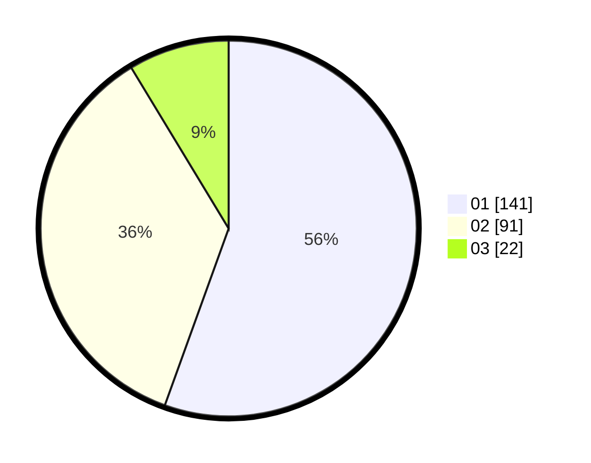

# Hasil

Hasil perolehan suara paslon dapat dilihat pada file paslon-01.txt, paslon-02.txt, dan paslon-03.txt.

Jika tidak ada, artinya data tersebut belum ada pada SIREKAP.

## Perolehan Suara

 * Paslon 01: **141**.
 * Paslon 02: **91**.
 * Paslon 03: **22**.

## Foto C Plano

https://sirekap-obj-formc.kpu.go.id/ac05/pemilu/ppwp/31/73/05/10/01/3173051001071-20240214-155114--6d244c6a-fe06-4e52-8460-4187b2c2e4c9.jpg

https://sirekap-obj-formc.kpu.go.id/ac05/pemilu/ppwp/31/73/05/10/01/3173051001071-20240214-222712--71e1ad2a-2bf5-49e0-a607-e242f2a78840.jpg

https://sirekap-obj-formc.kpu.go.id/ac05/pemilu/ppwp/31/73/05/10/01/3173051001071-20240214-155539--178e0d57-04d3-4046-bafe-b1652cd66003.jpg
