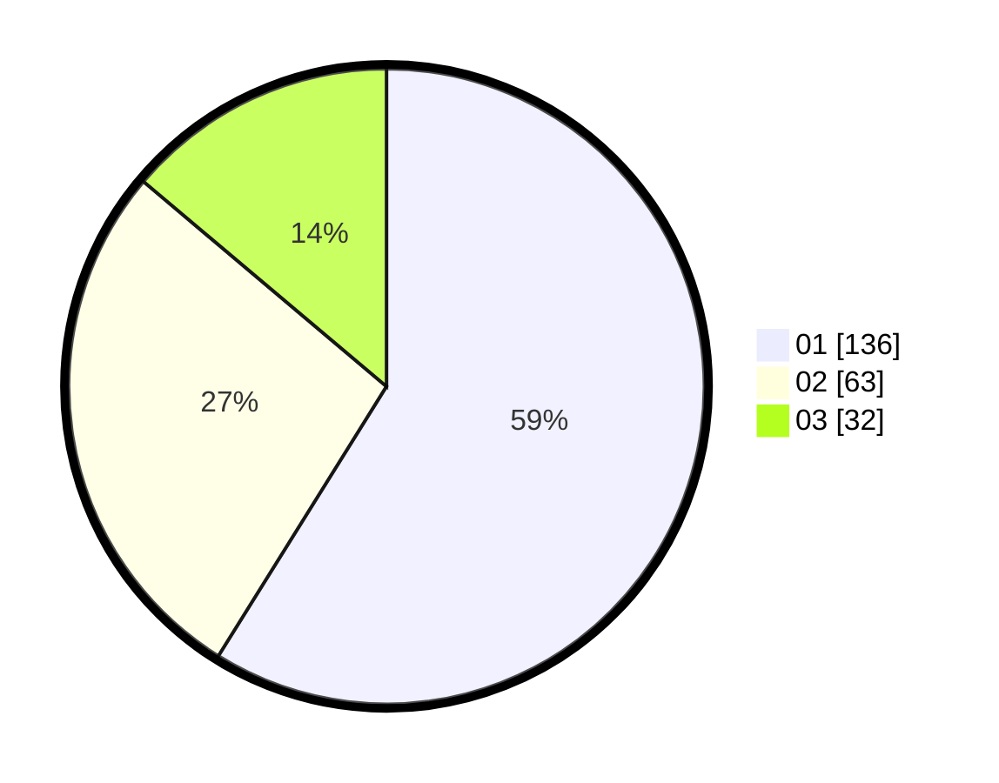

# Hasil

Hasil perolehan suara paslon dapat dilihat pada file paslon-01.txt, paslon-02.txt, dan paslon-03.txt.

Jika tidak ada, artinya data tersebut belum ada pada SIREKAP.

## Perolehan Suara

 * Paslon 01: **136**.
 * Paslon 02: **63**.
 * Paslon 03: **32**.

## Foto C Plano

https://sirekap-obj-formc.kpu.go.id/a52e/pemilu/ppwp/31/73/05/10/01/3173051001072-20240215-001726--b8eedf9e-5eba-4c93-ae73-49cb62fc28f0.jpg

https://sirekap-obj-formc.kpu.go.id/a52e/pemilu/ppwp/31/73/05/10/01/3173051001072-20240215-001856--be493eb8-296e-44f9-9f78-d7e90cc702bb.jpg

https://sirekap-obj-formc.kpu.go.id/a52e/pemilu/ppwp/31/73/05/10/01/3173051001072-20240215-002656--c38e9ff6-aaea-4bf6-84c3-fa16227c1469.jpg
