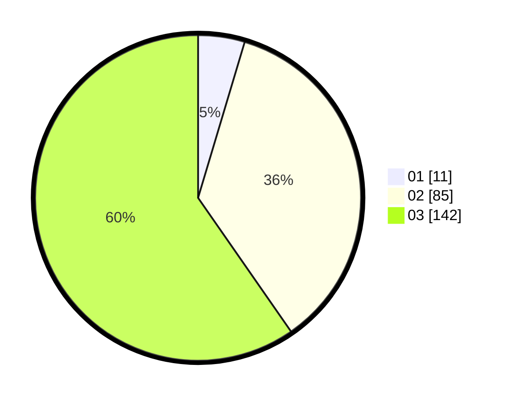

# Hasil

Hasil perolehan suara paslon dapat dilihat pada file paslon-01.txt, paslon-02.txt, dan paslon-03.txt.

Jika tidak ada, artinya data tersebut belum ada pada SIREKAP.

## Perolehan Suara

 * Paslon 01: **11**.
 * Paslon 02: **85**.
 * Paslon 03: **142**.

## Foto C Plano

https://sirekap-obj-formc.kpu.go.id/6306/pemilu/ppwp/31/73/05/10/01/3173051001073-20240214-194535--2a7e291e-c810-4308-b3e1-7004acd45a11.jpg

https://sirekap-obj-formc.kpu.go.id/6306/pemilu/ppwp/31/73/05/10/01/3173051001073-20240214-194600--099137fe-ad8a-4e33-9aae-fda4d86e56ac.jpg

https://sirekap-obj-formc.kpu.go.id/6306/pemilu/ppwp/31/73/05/10/01/3173051001073-20240214-194617--8a3c438e-32b1-4389-b229-c167ab445a0e.jpg

## DATA PEMILIH TETAP

Jumlah pemilih dalam DPT: **295**.
 * L: **135**.
 * P: **160**.

## DATA PENGGUNA HAK PILIH

Jumlah pengguna hak pilih dalam DPT: **218**.
 * L: **96**.
 * P: **122**.

Jumlah pengguna hak pilih dalam DPTb: **16**.
 * L: **1**.
 * P: **15**.

Jumlah pengguna hak pilih dalam DPK: **5**.
 * L: **3**.
 * P: **2**.

Jumlah pengguna hak pilih: **239**.
 * L: **100**.
 * P: **139**.

## JUMLAH SUARA SAH DAN TIDAK SAH

JUMLAH SELURUH SUARA SAH: **238**.

JUMLAH SUARA TIDAK SAH: **1**.

JUMLAH SELURUH SUARA SAH DAN SUARA TIDAK SAH: **239**.
