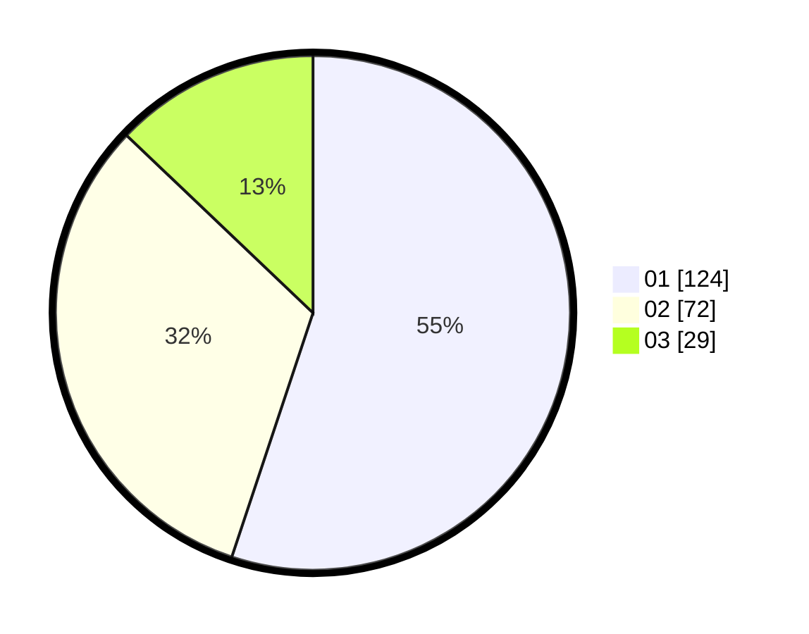

# Hasil

Hasil perolehan suara paslon dapat dilihat pada file paslon-01.txt, paslon-02.txt, dan paslon-03.txt.

Jika tidak ada, artinya data tersebut belum ada pada SIREKAP.

## Perolehan Suara

 * Paslon 01: **124**.
 * Paslon 02: **72**.
 * Paslon 03: **29**.

## Foto C Plano

https://sirekap-obj-formc.kpu.go.id/41ea/pemilu/ppwp/31/73/05/10/01/3173051001077-20240216-093804--75156259-8436-425b-921c-5b5193e2717b.jpg

https://sirekap-obj-formc.kpu.go.id/41ea/pemilu/ppwp/31/73/05/10/01/3173051001077-20240215-174933--30add1d3-3295-4fd3-8651-9ad72fefa091.jpg
