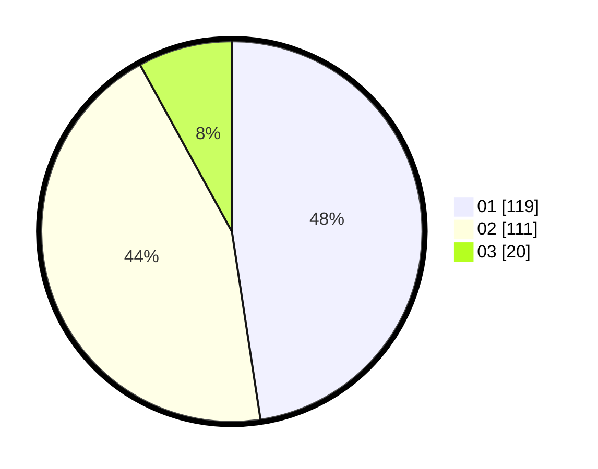

# Hasil

Hasil perolehan suara paslon dapat dilihat pada file paslon-01.txt, paslon-02.txt, dan paslon-03.txt.

Jika tidak ada, artinya data tersebut belum ada pada SIREKAP.

## Perolehan Suara

 * Paslon 01: **119**.
 * Paslon 02: **111**.
 * Paslon 03: **20**.

## Foto C Plano

https://sirekap-obj-formc.kpu.go.id/a3f3/pemilu/ppwp/31/73/05/10/01/3173051001079-20240214-203128--4e70d517-6b94-4b35-8fd9-30c27b4f3a58.jpg

https://sirekap-obj-formc.kpu.go.id/a3f3/pemilu/ppwp/31/73/05/10/01/3173051001079-20240214-203401--f983f35c-0ba4-4773-a8e6-da88ee34a24f.jpg

https://sirekap-obj-formc.kpu.go.id/a3f3/pemilu/ppwp/31/73/05/10/01/3173051001079-20240214-200831--8e9d0455-9e00-4ddd-9865-9aec1da4d0fe.jpg
