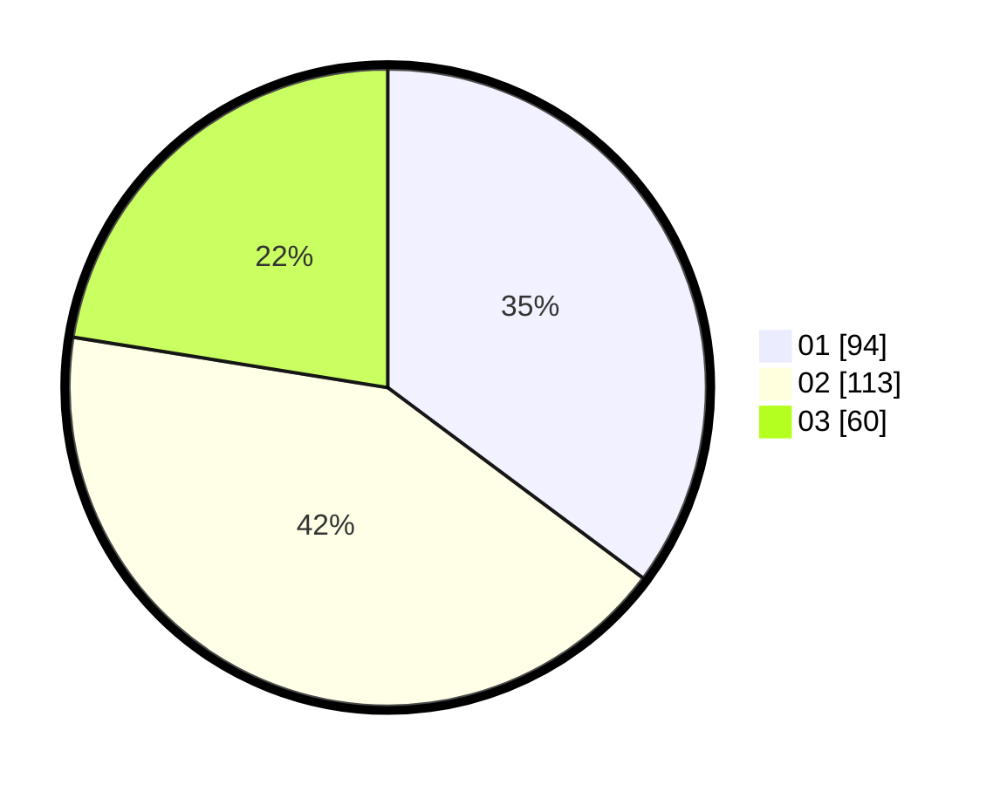

# Hasil

Hasil perolehan suara paslon dapat dilihat pada file paslon-01.txt, paslon-02.txt, dan paslon-03.txt.

Jika tidak ada, artinya data tersebut belum ada pada SIREKAP.

## Perolehan Suara

 * Paslon 01: **94**.
 * Paslon 02: **113**.
 * Paslon 03: **60**.

## Foto C Plano

https://sirekap-obj-formc.kpu.go.id/0f66/pemilu/ppwp/31/73/05/10/01/3173051001081-20240215-220833--a5dde1cc-ee5b-4c61-a5aa-63b4f2a6bbae.jpg

https://sirekap-obj-formc.kpu.go.id/0f66/pemilu/ppwp/31/73/05/10/01/3173051001081-20240215-222159--ff0c2027-4478-41f1-94e9-f05c267f67e9.jpg
