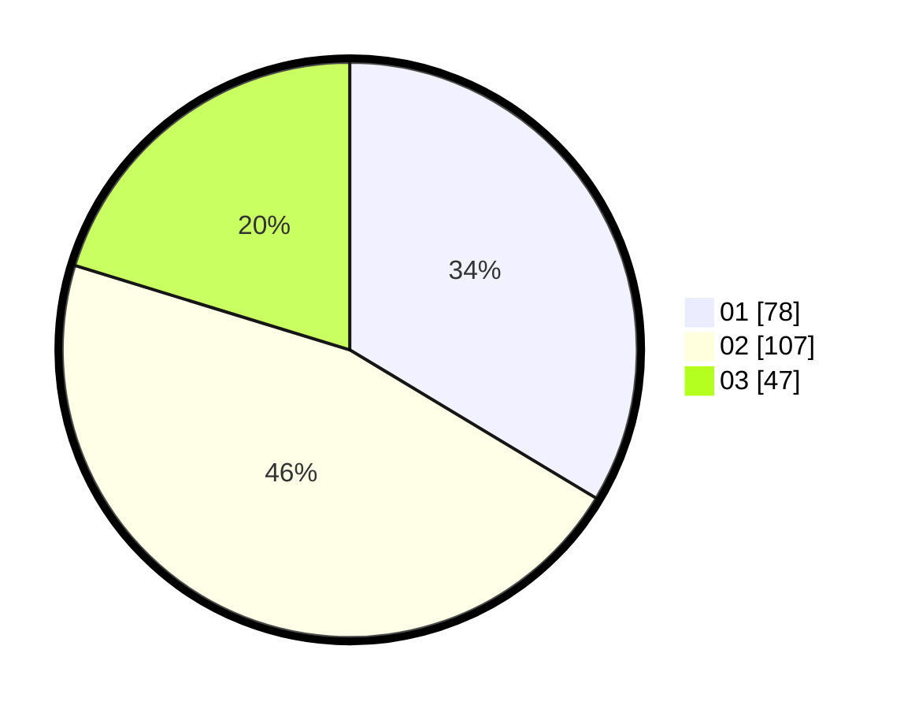

# Hasil

Hasil perolehan suara paslon dapat dilihat pada file paslon-01.txt, paslon-02.txt, dan paslon-03.txt.

Jika tidak ada, artinya data tersebut belum ada pada SIREKAP.

## Perolehan Suara

 * Paslon 01: **78**.
 * Paslon 02: **107**.
 * Paslon 03: **47**.

## Foto C Plano

https://sirekap-obj-formc.kpu.go.id/a022/pemilu/ppwp/31/73/05/10/01/3173051001082-20240216-063313--1bdb3062-478f-4a6a-a29e-542f50e1c0bd.jpg

https://sirekap-obj-formc.kpu.go.id/a022/pemilu/ppwp/31/73/05/10/01/3173051001082-20240216-063435--5656b8e1-a3e6-4fd7-8c8b-c470e0991d0e.jpg

https://sirekap-obj-formc.kpu.go.id/a022/pemilu/ppwp/31/73/05/10/01/3173051001082-20240216-063505--9aeb15ca-cc26-4cb0-a500-8fe988e2ddbe.jpg
