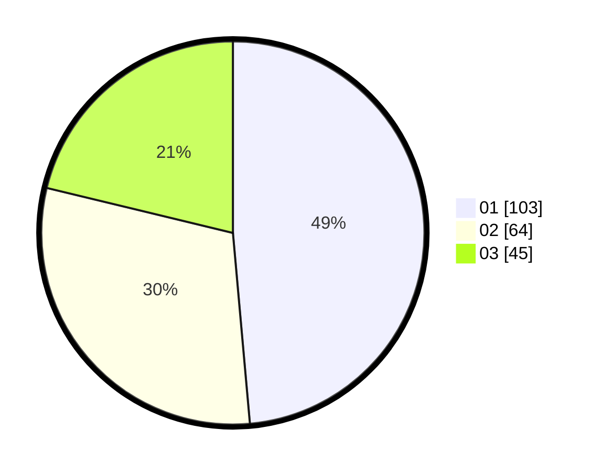

# Hasil

Hasil perolehan suara paslon dapat dilihat pada file paslon-01.txt, paslon-02.txt, dan paslon-03.txt.

Jika tidak ada, artinya data tersebut belum ada pada SIREKAP.

## Perolehan Suara

 * Paslon 01: **103**.
 * Paslon 02: **64**.
 * Paslon 03: **45**.

## Foto C Plano

https://sirekap-obj-formc.kpu.go.id/d0e2/pemilu/ppwp/31/73/05/10/01/3173051001096-20240214-191412--057351b7-ed11-49a7-81d5-605b0a86b010.jpg

https://sirekap-obj-formc.kpu.go.id/d0e2/pemilu/ppwp/31/73/05/10/01/3173051001096-20240214-211330--0e4e389c-128a-44d6-ab83-2d0bc6379226.jpg

https://sirekap-obj-formc.kpu.go.id/d0e2/pemilu/ppwp/31/73/05/10/01/3173051001096-20240214-211403--1a20aa2a-b0f8-4c6b-bdb3-dff77cc6bc64.jpg

## DATA PEMILIH TETAP

Jumlah pemilih dalam DPT: **283**.
 * L: **150**.
 * P: **133**.

## DATA PENGGUNA HAK PILIH

Jumlah pengguna hak pilih dalam DPT: **206**.
 * L: **94**.
 * P: **112**.

Jumlah pengguna hak pilih dalam DPTb: **9**.
 * L: **3**.
 * P: **6**.

Jumlah pengguna hak pilih dalam DPK: **0**.
 * L: **0**.
 * P: **0**.

Jumlah pengguna hak pilih: **215**.
 * L: **97**.
 * P: **118**.

## JUMLAH SUARA SAH DAN TIDAK SAH

JUMLAH SELURUH SUARA SAH: **212**.

JUMLAH SUARA TIDAK SAH: **3**.

JUMLAH SELURUH SUARA SAH DAN SUARA TIDAK SAH: **215**.
