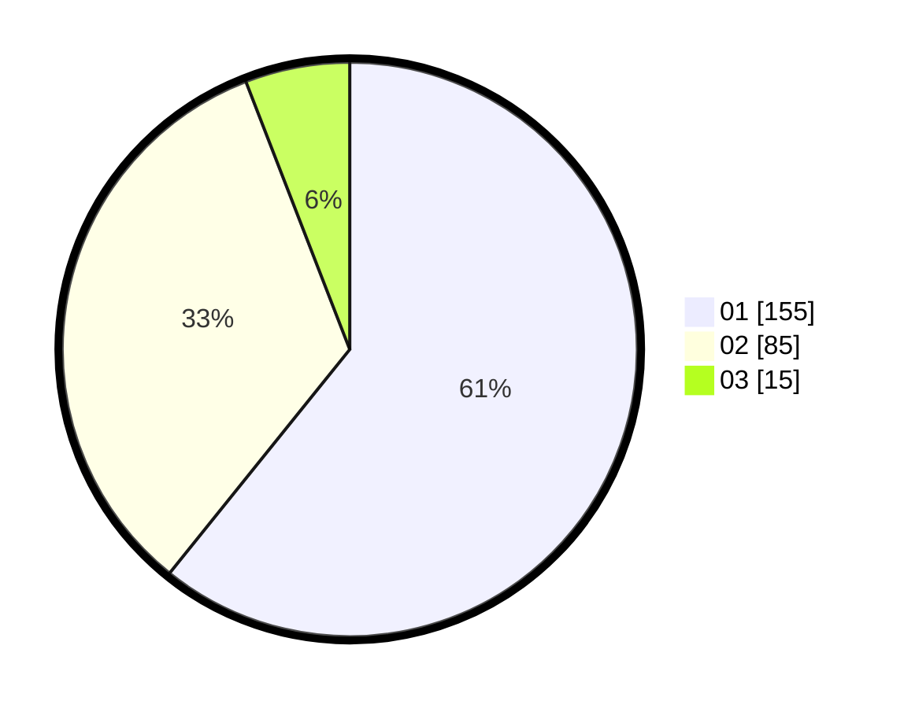

# Hasil

Hasil perolehan suara paslon dapat dilihat pada file paslon-01.txt, paslon-02.txt, dan paslon-03.txt.

Jika tidak ada, artinya data tersebut belum ada pada SIREKAP.

## Perolehan Suara

 * Paslon 01: **155**.
 * Paslon 02: **85**.
 * Paslon 03: **15**.

## Foto C Plano

https://sirekap-obj-formc.kpu.go.id/67b4/pemilu/ppwp/31/73/05/10/01/3173051001113-20240215-004151--7f3c010e-7700-4f29-a31c-a5c730f7dea1.jpg

https://sirekap-obj-formc.kpu.go.id/67b4/pemilu/ppwp/31/73/05/10/01/3173051001113-20240215-004302--fcc8e7d4-eca3-466b-aa6d-f0dbb60b797f.jpg

https://sirekap-obj-formc.kpu.go.id/67b4/pemilu/ppwp/31/73/05/10/01/3173051001113-20240214-231638--322c2105-48d7-49b3-9e84-2e4fb50b6c94.jpg
