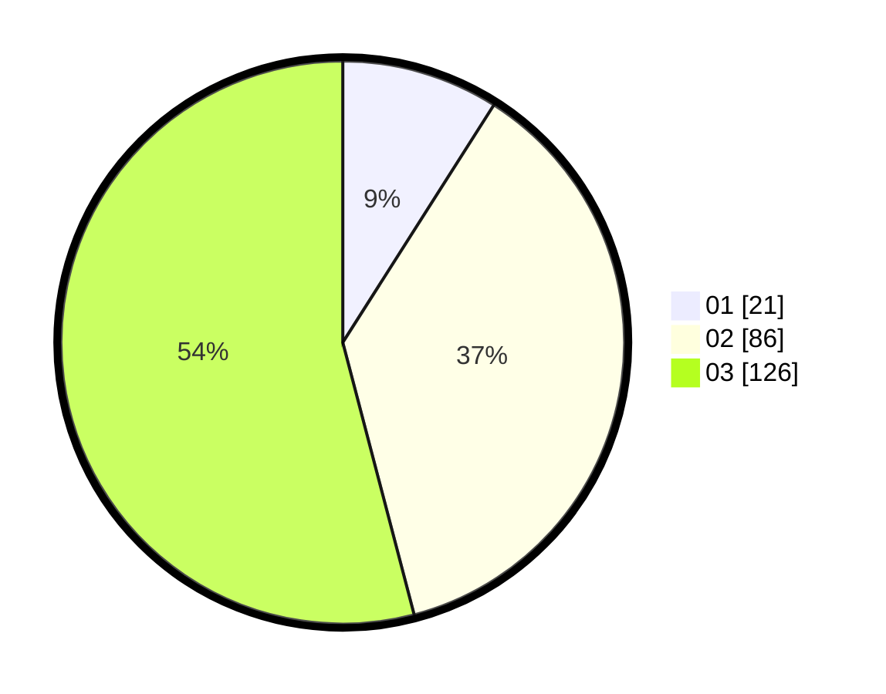

# Hasil

Hasil perolehan suara paslon dapat dilihat pada file paslon-01.txt, paslon-02.txt, dan paslon-03.txt.

Jika tidak ada, artinya data tersebut belum ada pada SIREKAP.

## Perolehan Suara

 * Paslon 01: **21**.
 * Paslon 02: **86**.
 * Paslon 03: **126**.

## Foto C Plano

https://sirekap-obj-formc.kpu.go.id/6f27/pemilu/ppwp/31/73/05/10/01/3173051001114-20240216-021135--89cbe27c-f81b-40c3-ab34-27a4b45d5bf2.jpg

https://sirekap-obj-formc.kpu.go.id/6f27/pemilu/ppwp/31/73/05/10/01/3173051001114-20240214-203024--85e312c3-9dc0-4a76-8755-0c568a2f34b0.jpg

https://sirekap-obj-formc.kpu.go.id/6f27/pemilu/ppwp/31/73/05/10/01/3173051001114-20240216-021136--758af13c-69f5-4a0f-afd0-5839d6c7c1a6.jpg

## DATA PEMILIH TETAP

Jumlah pemilih dalam DPT: **250**.
 * L: **118**.
 * P: **132**.

## DATA PENGGUNA HAK PILIH

Jumlah pengguna hak pilih dalam DPT: **211**.
 * L: **97**.
 * P: **114**.

Jumlah pengguna hak pilih dalam DPTb: **13**.
 * L: **6**.
 * P: **7**.

Jumlah pengguna hak pilih dalam DPK: **9**.
 * L: **3**.
 * P: **6**.

Jumlah pengguna hak pilih: **233**.
 * L: **106**.
 * P: **127**.

## JUMLAH SUARA SAH DAN TIDAK SAH

JUMLAH SELURUH SUARA SAH: **233**.

JUMLAH SUARA TIDAK SAH: **0**.

JUMLAH SELURUH SUARA SAH DAN SUARA TIDAK SAH: **233**.
