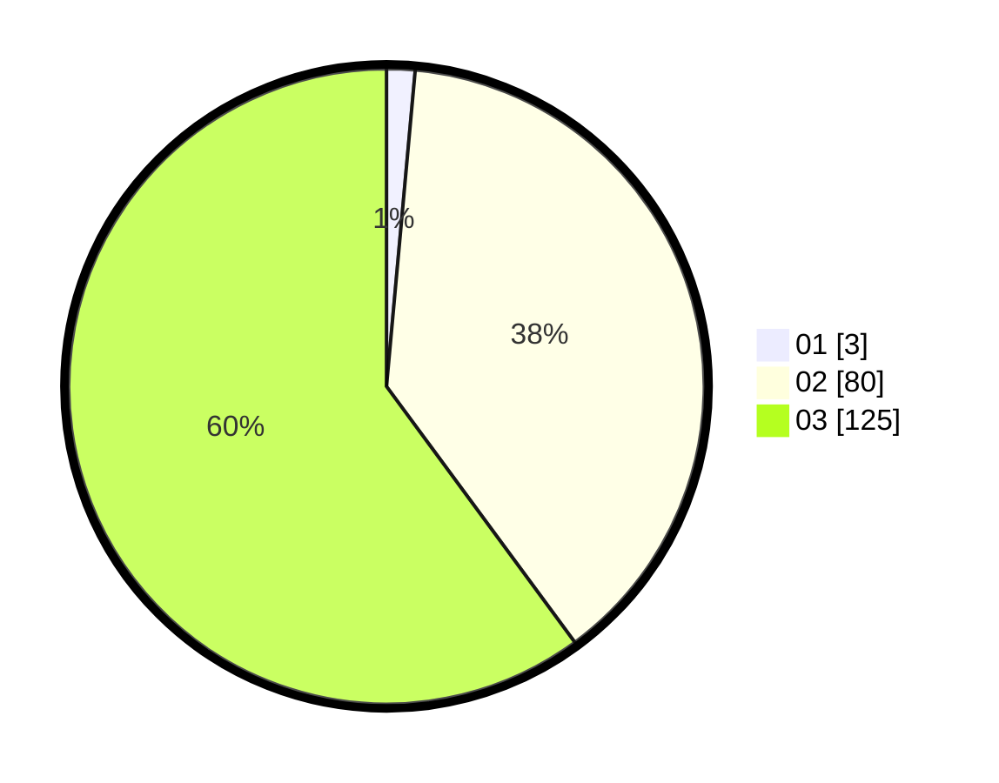

# Hasil

Hasil perolehan suara paslon dapat dilihat pada file paslon-01.txt, paslon-02.txt, dan paslon-03.txt.

Jika tidak ada, artinya data tersebut belum ada pada SIREKAP.

## Perolehan Suara

 * Paslon 01: **3**.
 * Paslon 02: **80**.
 * Paslon 03: **125**.

## Foto C Plano

https://sirekap-obj-formc.kpu.go.id/8444/pemilu/ppwp/31/73/05/10/01/3173051001115-20240216-023008--46b96987-7895-49e9-8ae3-c0ded4ad3b40.jpg

https://sirekap-obj-formc.kpu.go.id/8444/pemilu/ppwp/31/73/05/10/01/3173051001115-20240216-020827--3dc995a1-8cb1-48af-8beb-8351625d24a2.jpg

https://sirekap-obj-formc.kpu.go.id/8444/pemilu/ppwp/31/73/05/10/01/3173051001115-20240216-020825--1b918b3f-b51b-43a9-a85d-7bcae1944ccd.jpg

## DATA PEMILIH TETAP

Jumlah pemilih dalam DPT: **277**.
 * L: **132**.
 * P: **145**.

## DATA PENGGUNA HAK PILIH

Jumlah pengguna hak pilih dalam DPT: **200**.
 * L: **97**.
 * P: **103**.

Jumlah pengguna hak pilih dalam DPTb: **4**.
 * L: **0**.
 * P: **4**.

Jumlah pengguna hak pilih dalam DPK: **6**.
 * L: **3**.
 * P: **3**.

Jumlah pengguna hak pilih: **210**.
 * L: **100**.
 * P: **110**.

## JUMLAH SUARA SAH DAN TIDAK SAH

JUMLAH SELURUH SUARA SAH: **208**.

JUMLAH SUARA TIDAK SAH: **2**.

JUMLAH SELURUH SUARA SAH DAN SUARA TIDAK SAH: **210**.
