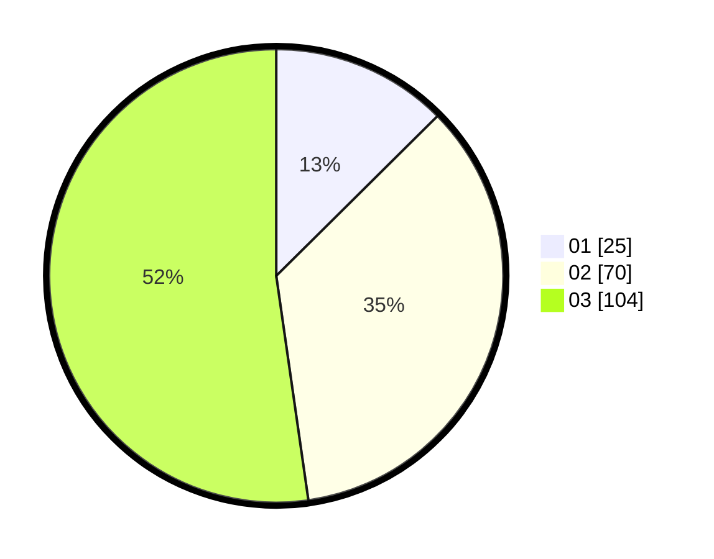

# Hasil

Hasil perolehan suara paslon dapat dilihat pada file paslon-01.txt, paslon-02.txt, dan paslon-03.txt.

Jika tidak ada, artinya data tersebut belum ada pada SIREKAP.

## Perolehan Suara

 * Paslon 01: **25**.
 * Paslon 02: **70**.
 * Paslon 03: **104**.

## Foto C Plano

https://sirekap-obj-formc.kpu.go.id/5a34/pemilu/ppwp/31/73/05/10/01/3173051001116-20240214-223050--0930ba67-9fa9-403e-8ce5-9fe6179e1c5c.jpg

https://sirekap-obj-formc.kpu.go.id/5a34/pemilu/ppwp/31/73/05/10/01/3173051001116-20240214-222936--e2ecbe37-b920-4523-a438-40f92138c37b.jpg

https://sirekap-obj-formc.kpu.go.id/5a34/pemilu/ppwp/31/73/05/10/01/3173051001116-20240214-223027--b900967e-f98a-4304-b56f-67076f5e2314.jpg
