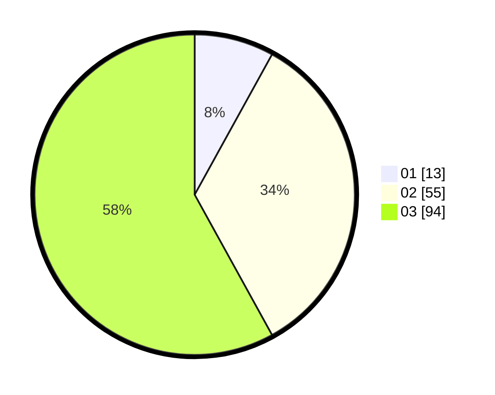

# Hasil

Hasil perolehan suara paslon dapat dilihat pada file paslon-01.txt, paslon-02.txt, dan paslon-03.txt.

Jika tidak ada, artinya data tersebut belum ada pada SIREKAP.

## Perolehan Suara

 * Paslon 01: **13**.
 * Paslon 02: **55**.
 * Paslon 03: **94**.

## Foto C Plano

https://sirekap-obj-formc.kpu.go.id/4eaa/pemilu/ppwp/31/73/05/10/01/3173051001117-20240214-200017--9a91cd6d-f4da-49ed-8c6c-399ec01024f0.jpg

https://sirekap-obj-formc.kpu.go.id/4eaa/pemilu/ppwp/31/73/05/10/01/3173051001117-20240214-200026--1955f03d-3e46-4a62-aaad-6ccc9dd859fd.jpg

https://sirekap-obj-formc.kpu.go.id/4eaa/pemilu/ppwp/31/73/05/10/01/3173051001117-20240214-200032--143c46b5-bee8-4085-9318-e3c4d05669ff.jpg

## DATA PEMILIH TETAP

Jumlah pemilih dalam DPT: **201**.
 * L: **95**.
 * P: **106**.

## DATA PENGGUNA HAK PILIH

Jumlah pengguna hak pilih dalam DPT: **159**.
 * L: **76**.
 * P: **83**.

Jumlah pengguna hak pilih dalam DPTb: **8**.
 * L: **0**.
 * P: **8**.

Jumlah pengguna hak pilih dalam DPK: **1**.
 * L: **0**.
 * P: **1**.

Jumlah pengguna hak pilih: **168**.
 * L: **76**.
 * P: **92**.

## JUMLAH SUARA SAH DAN TIDAK SAH

JUMLAH SELURUH SUARA SAH: **162**.

JUMLAH SUARA TIDAK SAH: **6**.

JUMLAH SELURUH SUARA SAH DAN SUARA TIDAK SAH: **168**.
