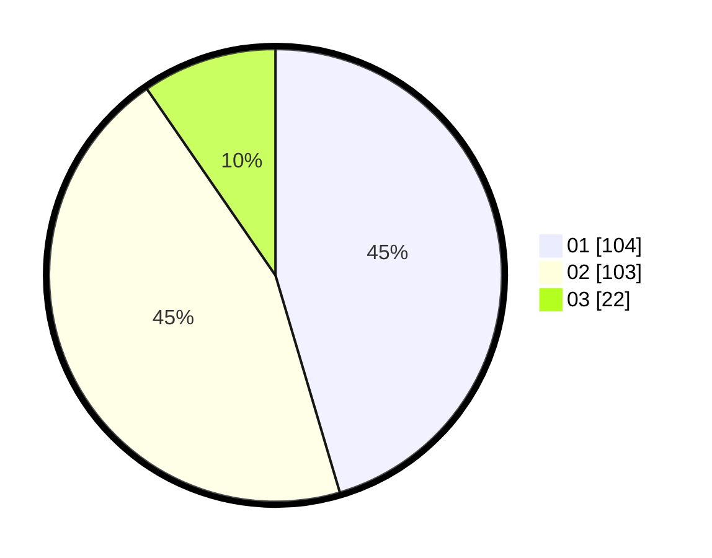

# Hasil

Hasil perolehan suara paslon dapat dilihat pada file paslon-01.txt, paslon-02.txt, dan paslon-03.txt.

Jika tidak ada, artinya data tersebut belum ada pada SIREKAP.

## Perolehan Suara

 * Paslon 01: **104**.
 * Paslon 02: **103**.
 * Paslon 03: **22**.

## Foto C Plano

https://sirekap-obj-formc.kpu.go.id/0250/pemilu/ppwp/31/73/05/10/01/3173051001119-20240214-211754--abcd3a49-95c2-4d32-b014-ee4779cba8cc.jpg

https://sirekap-obj-formc.kpu.go.id/0250/pemilu/ppwp/31/73/05/10/01/3173051001119-20240214-223928--8abb82a6-41f1-4429-a098-8cbef8176f25.jpg

https://sirekap-obj-formc.kpu.go.id/0250/pemilu/ppwp/31/73/05/10/01/3173051001119-20240214-212240--389ca6c1-05fc-4b96-9d3f-cbc71ba0d9fe.jpg

## DATA PEMILIH TETAP

Jumlah pemilih dalam DPT: **279**.
 * L: **140**.
 * P: **139**.

## DATA PENGGUNA HAK PILIH

Jumlah pengguna hak pilih dalam DPT: **226**.
 * L: **110**.
 * P: **116**.

Jumlah pengguna hak pilih dalam DPTb: **2**.
 * L: **1**.
 * P: **1**.

Jumlah pengguna hak pilih dalam DPK: **3**.
 * L: **0**.
 * P: **3**.

Jumlah pengguna hak pilih: **231**.
 * L: **111**.
 * P: **120**.

## JUMLAH SUARA SAH DAN TIDAK SAH

JUMLAH SELURUH SUARA SAH: **229**.

JUMLAH SUARA TIDAK SAH: **2**.

JUMLAH SELURUH SUARA SAH DAN SUARA TIDAK SAH: **231**.
