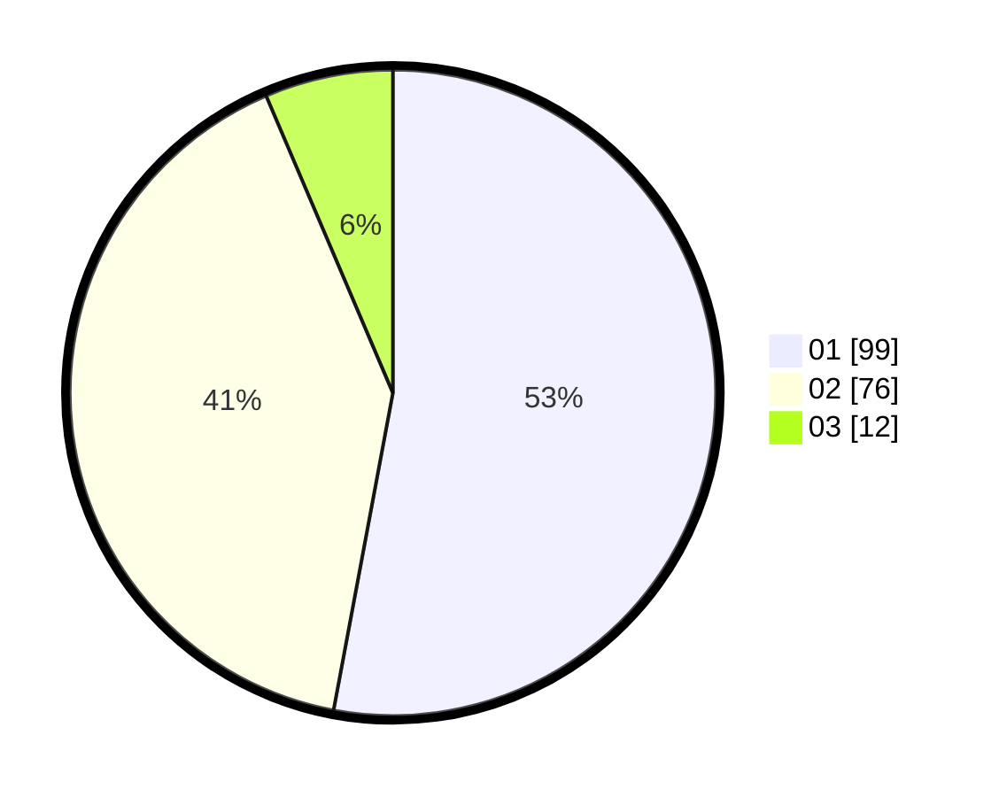

# Hasil

Hasil perolehan suara paslon dapat dilihat pada file paslon-01.txt, paslon-02.txt, dan paslon-03.txt.

Jika tidak ada, artinya data tersebut belum ada pada SIREKAP.

## Perolehan Suara

 * Paslon 01: **99**.
 * Paslon 02: **76**.
 * Paslon 03: **12**.

## Foto C Plano

https://sirekap-obj-formc.kpu.go.id/a140/pemilu/ppwp/31/73/05/10/01/3173051001121-20240214-191401--e9561c7f-eec7-43ee-90a9-bb4af4b86e25.jpg

https://sirekap-obj-formc.kpu.go.id/a140/pemilu/ppwp/31/73/05/10/01/3173051001121-20240214-234619--d21dde97-39a1-4558-b18a-72df04cef0dd.jpg

https://sirekap-obj-formc.kpu.go.id/a140/pemilu/ppwp/31/73/05/10/01/3173051001121-20240214-191736--fda9a1cb-f426-4c1c-8e30-821865d009ac.jpg

## DATA PEMILIH TETAP

Jumlah pemilih dalam DPT: **224**.
 * L: **111**.
 * P: **113**.

## DATA PENGGUNA HAK PILIH

Jumlah pengguna hak pilih dalam DPT: **170**.
 * L: **82**.
 * P: **88**.

Jumlah pengguna hak pilih dalam DPTb: **9**.
 * L: **5**.
 * P: **4**.

Jumlah pengguna hak pilih dalam DPK: **8**.
 * L: **2**.
 * P: **6**.

Jumlah pengguna hak pilih: **187**.
 * L: **89**.
 * P: **98**.

## JUMLAH SUARA SAH DAN TIDAK SAH

JUMLAH SELURUH SUARA SAH: **187**.

JUMLAH SUARA TIDAK SAH: **0**.

JUMLAH SELURUH SUARA SAH DAN SUARA TIDAK SAH: **187**.
