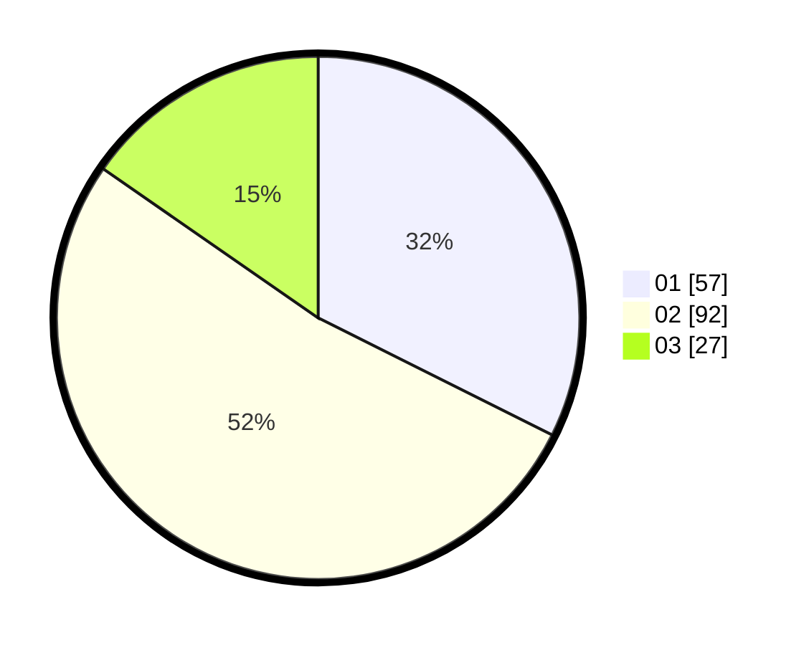

# Hasil

Hasil perolehan suara paslon dapat dilihat pada file paslon-01.txt, paslon-02.txt, dan paslon-03.txt.

Jika tidak ada, artinya data tersebut belum ada pada SIREKAP.

## Perolehan Suara

 * Paslon 01: **57**.
 * Paslon 02: **92**.
 * Paslon 03: **27**.

## Foto C Plano

https://sirekap-obj-formc.kpu.go.id/c4cc/pemilu/ppwp/31/73/05/10/01/3173051001122-20240215-034106--79d79941-72ba-4790-af95-1cced8f76d1f.jpg

https://sirekap-obj-formc.kpu.go.id/c4cc/pemilu/ppwp/31/73/05/10/01/3173051001122-20240215-034151--62498570-e396-4294-bf9c-d55030a8a3d4.jpg

https://sirekap-obj-formc.kpu.go.id/c4cc/pemilu/ppwp/31/73/05/10/01/3173051001122-20240215-034306--40ecbe17-aeaf-4c9d-aff3-166d9315b63c.jpg
