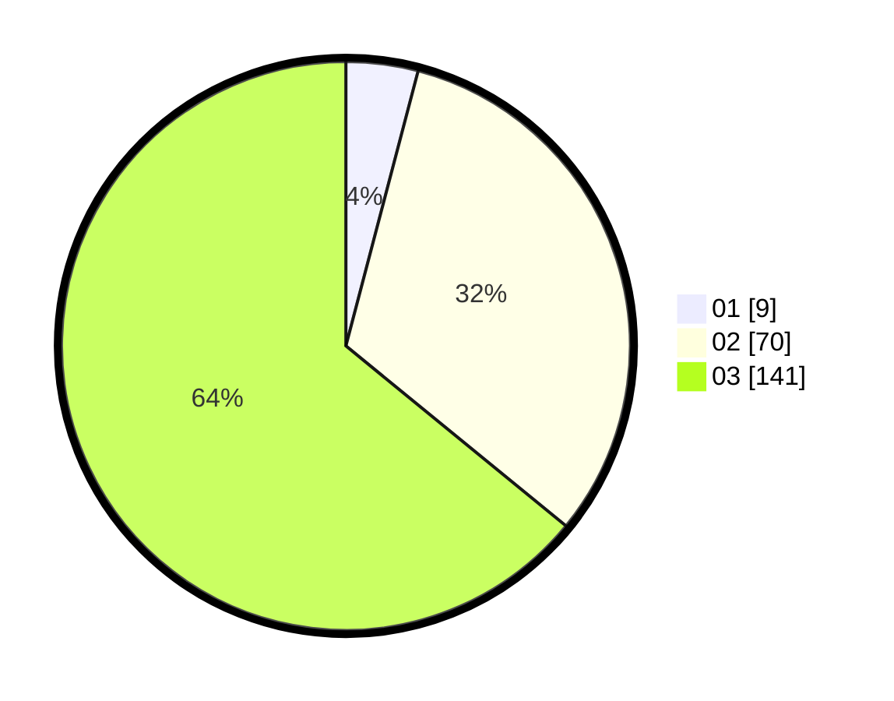

# Hasil

Hasil perolehan suara paslon dapat dilihat pada file paslon-01.txt, paslon-02.txt, dan paslon-03.txt.

Jika tidak ada, artinya data tersebut belum ada pada SIREKAP.

## Perolehan Suara

 * Paslon 01: **9**.
 * Paslon 02: **70**.
 * Paslon 03: **141**.

## Foto C Plano

https://sirekap-obj-formc.kpu.go.id/ef08/pemilu/ppwp/31/73/05/10/01/3173051001123-20240214-192514--655d1888-6232-43f2-a98c-b5a24674d7c9.jpg

https://sirekap-obj-formc.kpu.go.id/ef08/pemilu/ppwp/31/73/05/10/01/3173051001123-20240214-155733--8b4eb98c-c332-4577-a2d7-9555ac500d47.jpg

https://sirekap-obj-formc.kpu.go.id/ef08/pemilu/ppwp/31/73/05/10/01/3173051001123-20240214-160144--bc26f759-03b9-4643-8ee3-c326de93040f.jpg

## DATA PEMILIH TETAP

Jumlah pemilih dalam DPT: **275**.
 * L: **129**.
 * P: **146**.

## DATA PENGGUNA HAK PILIH

Jumlah pengguna hak pilih dalam DPT: **200**.
 * L: **88**.
 * P: **112**.

Jumlah pengguna hak pilih dalam DPTb: **15**.
 * L: **3**.
 * P: **12**.

Jumlah pengguna hak pilih dalam DPK: **5**.
 * L: **3**.
 * P: **2**.

Jumlah pengguna hak pilih: **220**.
 * L: **94**.
 * P: **126**.

## JUMLAH SUARA SAH DAN TIDAK SAH

JUMLAH SELURUH SUARA SAH: **220**.

JUMLAH SUARA TIDAK SAH: **1**.

JUMLAH SELURUH SUARA SAH DAN SUARA TIDAK SAH: **221**.
