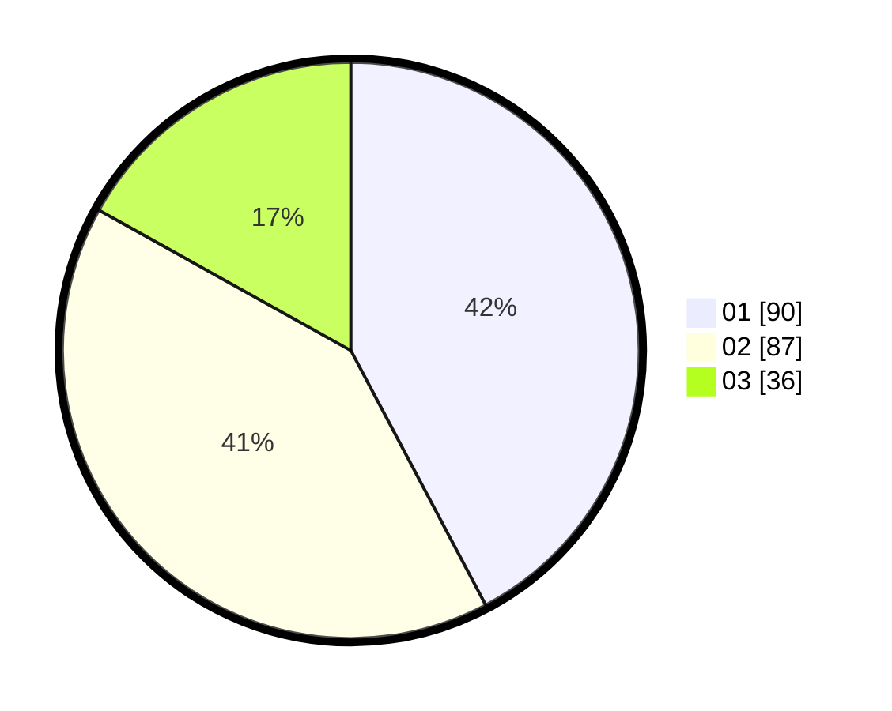

# Hasil

Hasil perolehan suara paslon dapat dilihat pada file paslon-01.txt, paslon-02.txt, dan paslon-03.txt.

Jika tidak ada, artinya data tersebut belum ada pada SIREKAP.

## Perolehan Suara

 * Paslon 01: **90**.
 * Paslon 02: **87**.
 * Paslon 03: **36**.

## Foto C Plano

https://sirekap-obj-formc.kpu.go.id/be24/pemilu/ppwp/31/73/05/10/01/3173051001128-20240214-222452--3d132ff5-496b-489a-bf97-9648b310393a.jpg

https://sirekap-obj-formc.kpu.go.id/be24/pemilu/ppwp/31/73/05/10/01/3173051001128-20240214-222924--04139bdf-021f-4e28-a4c4-76ae25d8ffe1.jpg

https://sirekap-obj-formc.kpu.go.id/be24/pemilu/ppwp/31/73/05/10/01/3173051001128-20240214-223520--d66a3540-c878-4eb2-80a8-344527f5183b.jpg
