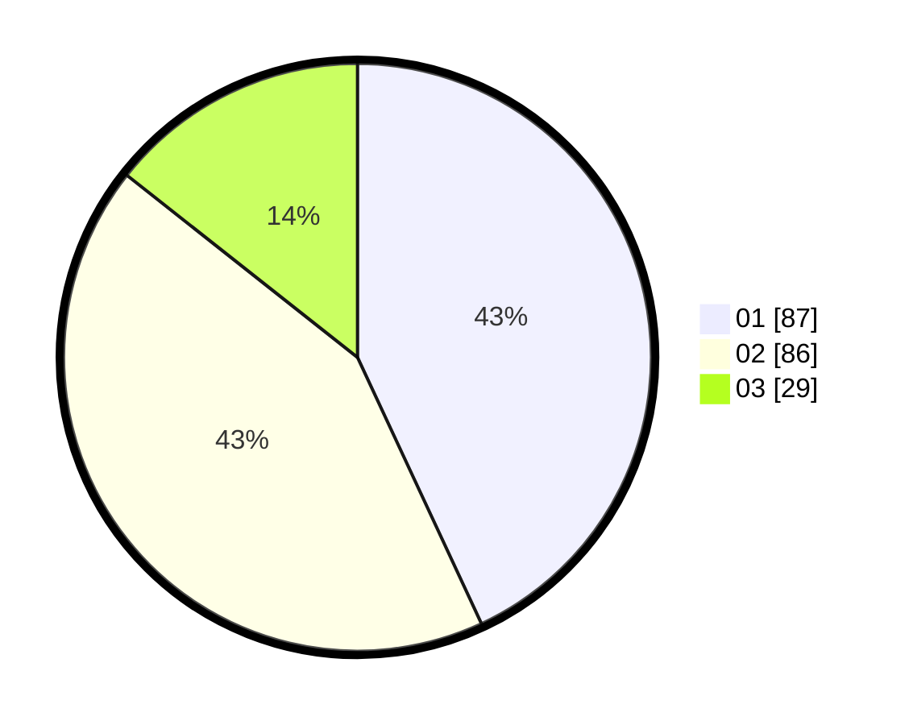

# Hasil

Hasil perolehan suara paslon dapat dilihat pada file paslon-01.txt, paslon-02.txt, dan paslon-03.txt.

Jika tidak ada, artinya data tersebut belum ada pada SIREKAP.

## Perolehan Suara

 * Paslon 01: **87**.
 * Paslon 02: **86**.
 * Paslon 03: **29**.

## Foto C Plano

https://sirekap-obj-formc.kpu.go.id/39c3/pemilu/ppwp/31/73/05/10/01/3173051001129-20240214-200059--5573ef96-eab0-447f-aa61-7f0c908e3ffb.jpg

https://sirekap-obj-formc.kpu.go.id/39c3/pemilu/ppwp/31/73/05/10/01/3173051001129-20240214-200421--c3d2030c-3cb4-4cfb-aa58-a8971b2717ab.jpg

https://sirekap-obj-formc.kpu.go.id/39c3/pemilu/ppwp/31/73/05/10/01/3173051001129-20240214-200714--28771aef-2014-430f-9608-f72e56b35c09.jpg
