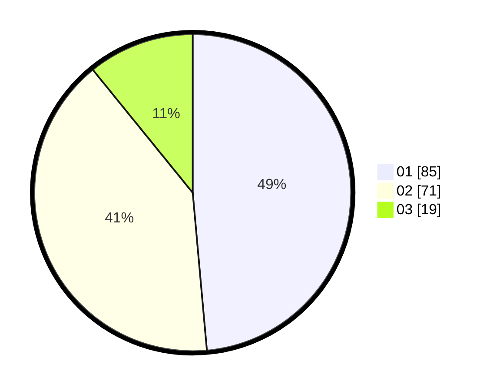

# Hasil

Hasil perolehan suara paslon dapat dilihat pada file paslon-01.txt, paslon-02.txt, dan paslon-03.txt.

Jika tidak ada, artinya data tersebut belum ada pada SIREKAP.

## Perolehan Suara

 * Paslon 01: **85**.
 * Paslon 02: **71**.
 * Paslon 03: **19**.

## Foto C Plano

https://sirekap-obj-formc.kpu.go.id/8c2c/pemilu/ppwp/31/73/05/10/01/3173051001130-20240215-001349--f4644782-3a18-4e04-9584-d196aaf64bfa.jpg

https://sirekap-obj-formc.kpu.go.id/8c2c/pemilu/ppwp/31/73/05/10/01/3173051001130-20240215-001152--f3d9e499-64d2-4912-9c05-3307e14680f7.jpg

https://sirekap-obj-formc.kpu.go.id/8c2c/pemilu/ppwp/31/73/05/10/01/3173051001130-20240215-001018--410c6cd6-1ef1-449f-8fc0-fcdee68de6de.jpg
