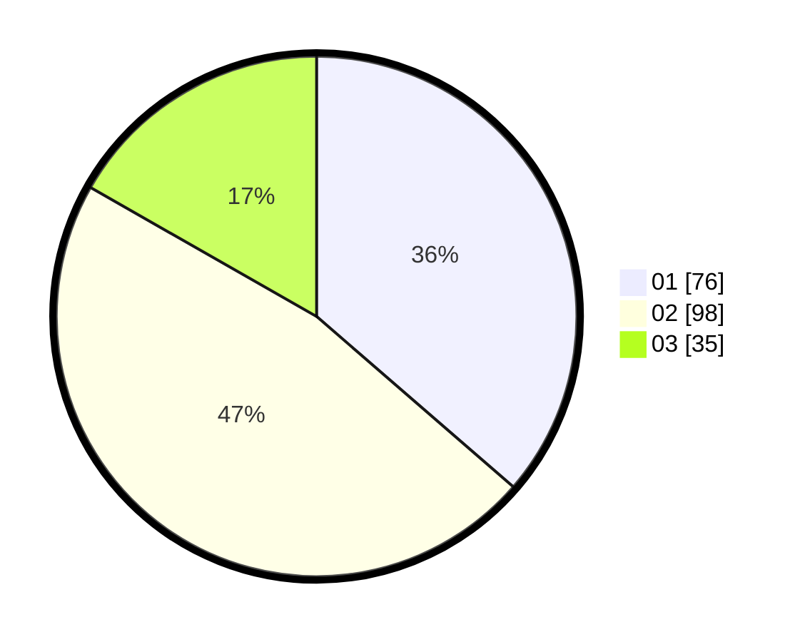

# Hasil

Hasil perolehan suara paslon dapat dilihat pada file paslon-01.txt, paslon-02.txt, dan paslon-03.txt.

Jika tidak ada, artinya data tersebut belum ada pada SIREKAP.

## Perolehan Suara

 * Paslon 01: **76**.
 * Paslon 02: **98**.
 * Paslon 03: **35**.

## Foto C Plano

https://sirekap-obj-formc.kpu.go.id/9322/pemilu/ppwp/31/73/05/10/01/3173051001136-20240215-033502--ee0f28b5-63d2-4c1d-a440-77fb25e369ec.jpg

https://sirekap-obj-formc.kpu.go.id/9322/pemilu/ppwp/31/73/05/10/01/3173051001136-20240215-033628--ea6574f4-4efd-49ec-8e00-e3c4c1806d6b.jpg

https://sirekap-obj-formc.kpu.go.id/9322/pemilu/ppwp/31/73/05/10/01/3173051001136-20240215-033911--e6f8c301-27bc-4f8c-b1f2-bb0fd4c97874.jpg
