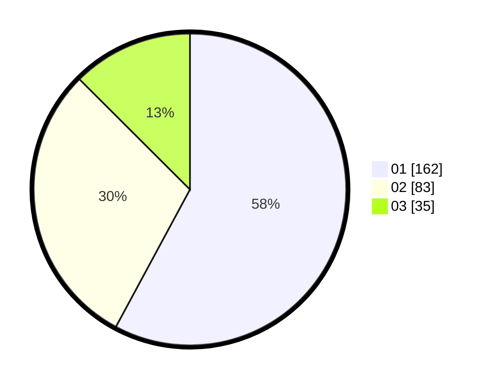

# Hasil

Hasil perolehan suara paslon dapat dilihat pada file paslon-01.txt, paslon-02.txt, dan paslon-03.txt.

Jika tidak ada, artinya data tersebut belum ada pada SIREKAP.

## Perolehan Suara

 * Paslon 01: **162**.
 * Paslon 02: **83**.
 * Paslon 03: **35**.

## Foto C Plano

https://sirekap-obj-formc.kpu.go.id/f3eb/pemilu/ppwp/31/73/05/10/01/3173051001142-20240214-233427--f4ec80c2-7d73-45fb-a0ce-bac4098aba73.jpg

https://sirekap-obj-formc.kpu.go.id/f3eb/pemilu/ppwp/31/73/05/10/01/3173051001142-20240214-233601--db93d1b0-288e-491a-8d3c-403b5a1dd874.jpg

https://sirekap-obj-formc.kpu.go.id/f3eb/pemilu/ppwp/31/73/05/10/01/3173051001142-20240214-233651--43d362b4-e312-4860-8d5e-6f9196e298ff.jpg
