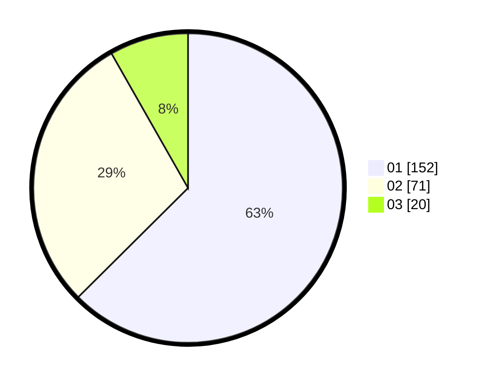

# Hasil

Hasil perolehan suara paslon dapat dilihat pada file paslon-01.txt, paslon-02.txt, dan paslon-03.txt.

Jika tidak ada, artinya data tersebut belum ada pada SIREKAP.

## Perolehan Suara

 * Paslon 01: **152**.
 * Paslon 02: **71**.
 * Paslon 03: **20**.

## Foto C Plano

https://sirekap-obj-formc.kpu.go.id/4b58/pemilu/ppwp/31/73/05/10/01/3173051001144-20240214-210429--0fac1e4b-97e7-4142-b559-d07dfbc9c137.jpg

https://sirekap-obj-formc.kpu.go.id/4b58/pemilu/ppwp/31/73/05/10/01/3173051001144-20240214-210513--36979b45-0ae6-4d1d-9fe8-96d3fa26ec94.jpg

https://sirekap-obj-formc.kpu.go.id/4b58/pemilu/ppwp/31/73/05/10/01/3173051001144-20240214-210618--7cd80b45-cd5f-4800-838c-9ef0d5c1452a.jpg

## DATA PEMILIH TETAP

Jumlah pemilih dalam DPT: **275**.
 * L: **132**.
 * P: **143**.

## DATA PENGGUNA HAK PILIH

Jumlah pengguna hak pilih dalam DPT: **222**.
 * L: **98**.
 * P: **124**.

Jumlah pengguna hak pilih dalam DPTb: **21**.
 * L: **10**.
 * P: **11**.

Jumlah pengguna hak pilih dalam DPK: **1**.
 * L: **0**.
 * P: **1**.

Jumlah pengguna hak pilih: **244**.
 * L: **108**.
 * P: **136**.

## JUMLAH SUARA SAH DAN TIDAK SAH

JUMLAH SELURUH SUARA SAH: **243**.

JUMLAH SUARA TIDAK SAH: **1**.

JUMLAH SELURUH SUARA SAH DAN SUARA TIDAK SAH: **244**.
