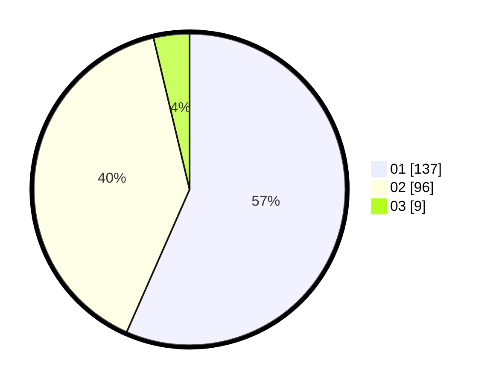

# Hasil

Hasil perolehan suara paslon dapat dilihat pada file paslon-01.txt, paslon-02.txt, dan paslon-03.txt.

Jika tidak ada, artinya data tersebut belum ada pada SIREKAP.

## Perolehan Suara

 * Paslon 01: **137**.
 * Paslon 02: **96**.
 * Paslon 03: **9**.

## Foto C Plano

https://sirekap-obj-formc.kpu.go.id/5ee8/pemilu/ppwp/31/73/05/10/01/3173051001150-20240214-213618--99c77824-2f9e-461d-906f-18346a1d0252.jpg

https://sirekap-obj-formc.kpu.go.id/5ee8/pemilu/ppwp/31/73/05/10/01/3173051001150-20240214-213713--c4b411f0-46ab-4ac1-bc0c-6bba9923d6e4.jpg

https://sirekap-obj-formc.kpu.go.id/5ee8/pemilu/ppwp/31/73/05/10/01/3173051001150-20240214-213825--633e66e4-4ef5-4d54-b7a9-175550073a36.jpg

## DATA PEMILIH TETAP

Jumlah pemilih dalam DPT: **292**.
 * L: **147**.
 * P: **145**.

## DATA PENGGUNA HAK PILIH

Jumlah pengguna hak pilih dalam DPT: **229**.
 * L: **114**.
 * P: **115**.

Jumlah pengguna hak pilih dalam DPTb: **11**.
 * L: **6**.
 * P: **5**.

Jumlah pengguna hak pilih dalam DPK: **5**.
 * L: **3**.
 * P: **2**.

Jumlah pengguna hak pilih: **245**.
 * L: **123**.
 * P: **122**.

## JUMLAH SUARA SAH DAN TIDAK SAH

JUMLAH SELURUH SUARA SAH: **242**.

JUMLAH SUARA TIDAK SAH: **3**.

JUMLAH SELURUH SUARA SAH DAN SUARA TIDAK SAH: **245**.
