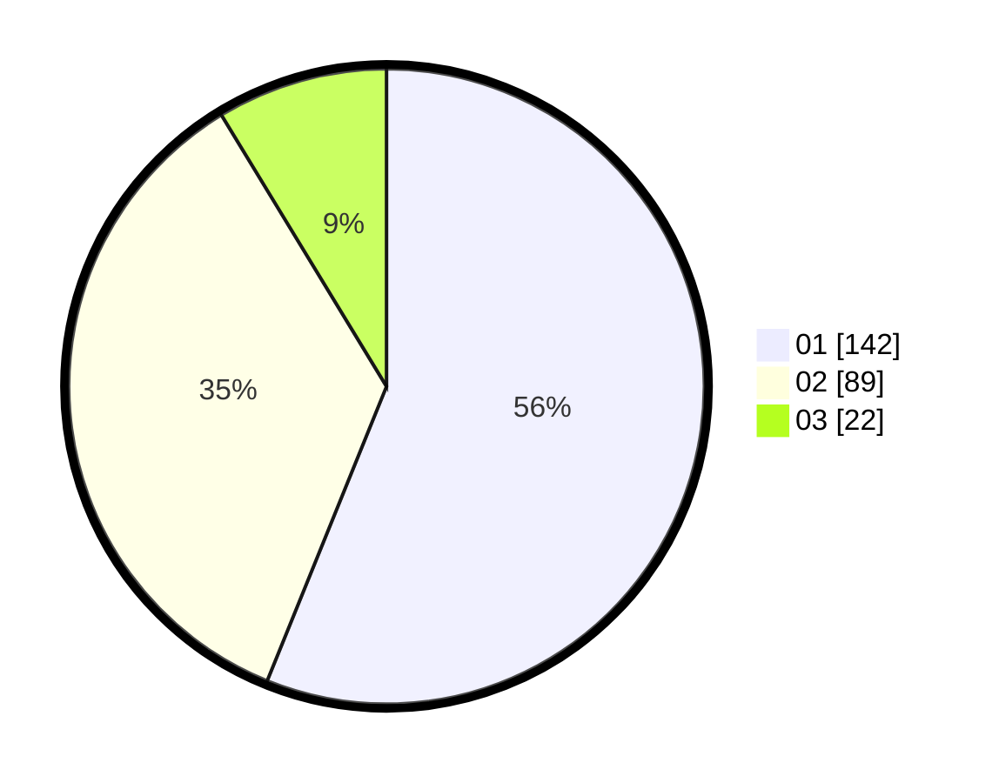

# Hasil

Hasil perolehan suara paslon dapat dilihat pada file paslon-01.txt, paslon-02.txt, dan paslon-03.txt.

Jika tidak ada, artinya data tersebut belum ada pada SIREKAP.

## Perolehan Suara

 * Paslon 01: **142**.
 * Paslon 02: **89**.
 * Paslon 03: **22**.

## Foto C Plano

https://sirekap-obj-formc.kpu.go.id/902f/pemilu/ppwp/31/73/05/10/01/3173051001155-20240215-005712--945772b5-e015-41f3-a0f5-3ca67f1f9961.jpg

https://sirekap-obj-formc.kpu.go.id/902f/pemilu/ppwp/31/73/05/10/01/3173051001155-20240215-005804--3be92e62-9072-4058-95f1-a89403b6dea0.jpg

https://sirekap-obj-formc.kpu.go.id/902f/pemilu/ppwp/31/73/05/10/01/3173051001155-20240215-005930--20ee272a-1f09-4508-86e8-7757c9a832bb.jpg
