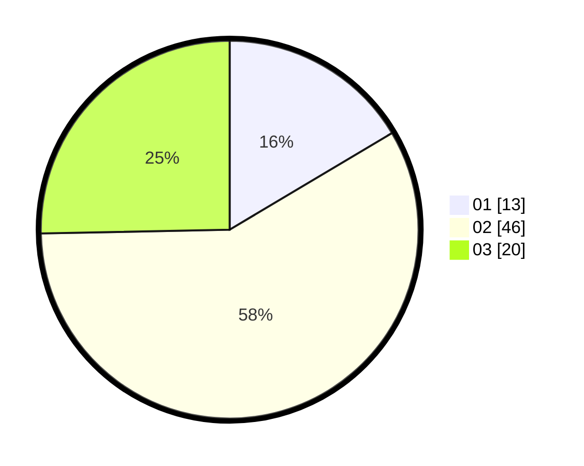

# Hasil

Hasil perolehan suara paslon dapat dilihat pada file paslon-01.txt, paslon-02.txt, dan paslon-03.txt.

Jika tidak ada, artinya data tersebut belum ada pada SIREKAP.

## Perolehan Suara

 * Paslon 01: **13**.
 * Paslon 02: **46**.
 * Paslon 03: **20**.

## Foto C Plano

https://sirekap-obj-formc.kpu.go.id/489d/pemilu/ppwp/31/73/05/10/01/3173051001156-20240214-231737--2b628441-3b90-4096-b840-9277cc5cdd69.jpg

https://sirekap-obj-formc.kpu.go.id/489d/pemilu/ppwp/31/73/05/10/01/3173051001156-20240214-231842--db2a76c9-dd0e-41c3-9ad5-a51ac4e9f148.jpg

https://sirekap-obj-formc.kpu.go.id/489d/pemilu/ppwp/31/73/05/10/01/3173051001156-20240214-231925--c6493d2e-12ef-42c3-a5df-2fe675c665f1.jpg
