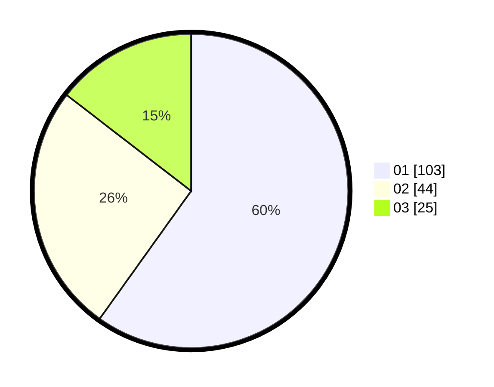

# Hasil

Hasil perolehan suara paslon dapat dilihat pada file paslon-01.txt, paslon-02.txt, dan paslon-03.txt.

Jika tidak ada, artinya data tersebut belum ada pada SIREKAP.

## Perolehan Suara

 * Paslon 01: **103**.
 * Paslon 02: **44**.
 * Paslon 03: **25**.

## Foto C Plano

https://sirekap-obj-formc.kpu.go.id/f6f6/pemilu/ppwp/31/73/05/10/01/3173051001161-20240214-203614--ba9f03b3-6e8b-4719-a58b-23092311fa5b.jpg

https://sirekap-obj-formc.kpu.go.id/f6f6/pemilu/ppwp/31/73/05/10/01/3173051001161-20240214-203618--e5483151-950f-4851-8a13-f8ce2b978871.jpg

https://sirekap-obj-formc.kpu.go.id/f6f6/pemilu/ppwp/31/73/05/10/01/3173051001161-20240214-203602--4efe4b4f-262c-4db7-b6b1-b9aeb91ff732.jpg
