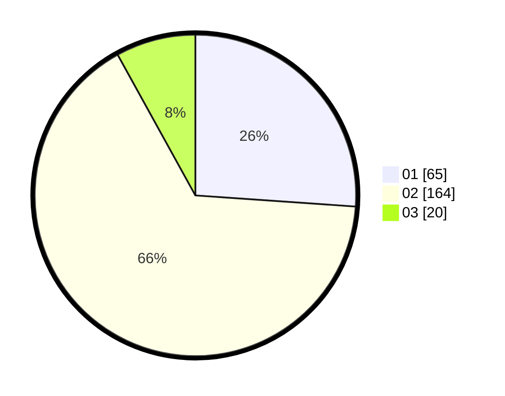

# Hasil

Hasil perolehan suara paslon dapat dilihat pada file paslon-01.txt, paslon-02.txt, dan paslon-03.txt.

Jika tidak ada, artinya data tersebut belum ada pada SIREKAP.

## Perolehan Suara

 * Paslon 01: **65**.
 * Paslon 02: **164**.
 * Paslon 03: **20**.

## Foto C Plano

https://sirekap-obj-formc.kpu.go.id/0859/pemilu/ppwp/31/73/05/10/01/3173051001162-20240215-000416--6888581b-fe43-4c27-ba6a-ebf0e5fa4253.jpg

https://sirekap-obj-formc.kpu.go.id/0859/pemilu/ppwp/31/73/05/10/01/3173051001162-20240215-000434--091df57c-d5f3-4d88-9e26-a16056d12ef1.jpg

https://sirekap-obj-formc.kpu.go.id/0859/pemilu/ppwp/31/73/05/10/01/3173051001162-20240215-000452--7077a63e-2b2f-4931-83e5-840f357fa037.jpg
