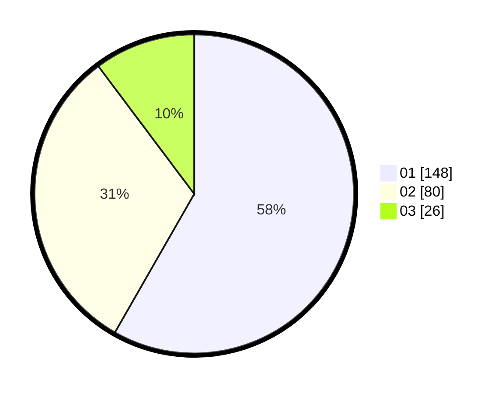

# Hasil

Hasil perolehan suara paslon dapat dilihat pada file paslon-01.txt, paslon-02.txt, dan paslon-03.txt.

Jika tidak ada, artinya data tersebut belum ada pada SIREKAP.

## Perolehan Suara

 * Paslon 01: **148**.
 * Paslon 02: **80**.
 * Paslon 03: **26**.

## Foto C Plano

https://sirekap-obj-formc.kpu.go.id/c407/pemilu/ppwp/31/73/05/10/01/3173051001166-20240214-185057--53ef5e4d-0b23-4541-bfe4-8c1d1706d09c.jpg

https://sirekap-obj-formc.kpu.go.id/c407/pemilu/ppwp/31/73/05/10/01/3173051001166-20240214-205229--05240fa4-40eb-49a2-906a-8b1addf9ca36.jpg

https://sirekap-obj-formc.kpu.go.id/c407/pemilu/ppwp/31/73/05/10/01/3173051001166-20240214-185454--15c0746a-f4e1-45a1-acae-aa16ffc9dd55.jpg

## DATA PEMILIH TETAP

Jumlah pemilih dalam DPT: **278**.
 * L: **145**.
 * P: **133**.

## DATA PENGGUNA HAK PILIH

Jumlah pengguna hak pilih dalam DPT: **234**.
 * L: **122**.
 * P: **112**.

Jumlah pengguna hak pilih dalam DPTb: **15**.
 * L: **8**.
 * P: **7**.

Jumlah pengguna hak pilih dalam DPK: **8**.
 * L: **6**.
 * P: **2**.

Jumlah pengguna hak pilih: **257**.
 * L: **136**.
 * P: **121**.

## JUMLAH SUARA SAH DAN TIDAK SAH

JUMLAH SELURUH SUARA SAH: **254**.

JUMLAH SUARA TIDAK SAH: **7**.

JUMLAH SELURUH SUARA SAH DAN SUARA TIDAK SAH: **261**.
