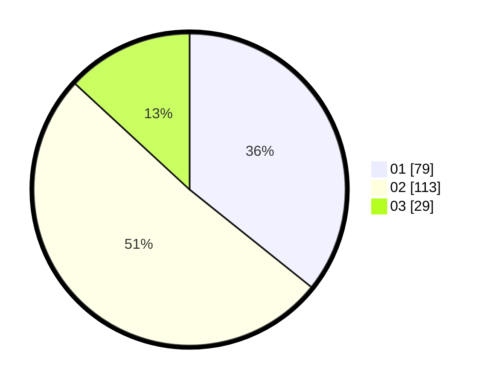

# Hasil

Hasil perolehan suara paslon dapat dilihat pada file paslon-01.txt, paslon-02.txt, dan paslon-03.txt.

Jika tidak ada, artinya data tersebut belum ada pada SIREKAP.

## Perolehan Suara

 * Paslon 01: **79**.
 * Paslon 02: **113**.
 * Paslon 03: **29**.

## Foto C Plano

https://sirekap-obj-formc.kpu.go.id/ba05/pemilu/ppwp/31/73/05/10/01/3173051001168-20240214-212016--8ef9a8d4-26ce-41e1-9206-e6adc112631d.jpg

https://sirekap-obj-formc.kpu.go.id/ba05/pemilu/ppwp/31/73/05/10/01/3173051001168-20240214-214919--d2dc67b1-46b0-448b-a800-5eeb9b514814.jpg
