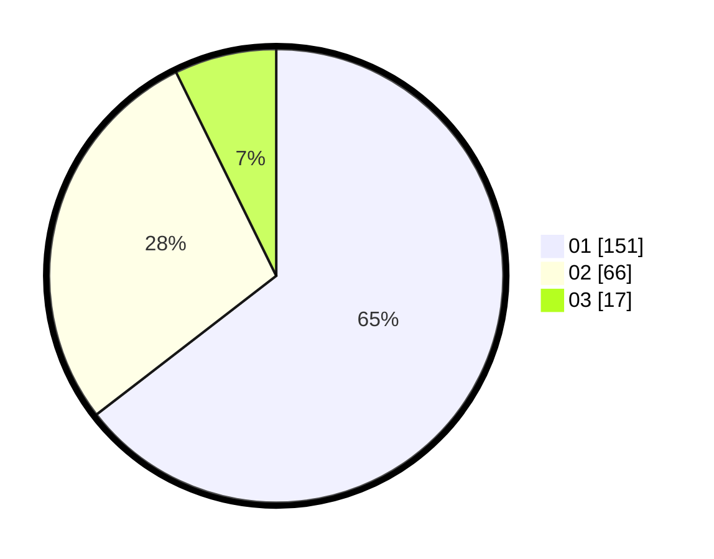

# Hasil

Hasil perolehan suara paslon dapat dilihat pada file paslon-01.txt, paslon-02.txt, dan paslon-03.txt.

Jika tidak ada, artinya data tersebut belum ada pada SIREKAP.

## Perolehan Suara

 * Paslon 01: **151**.
 * Paslon 02: **66**.
 * Paslon 03: **17**.

## Foto C Plano

https://sirekap-obj-formc.kpu.go.id/fd30/pemilu/ppwp/31/73/05/10/01/3173051001169-20240214-234818--7d29f5fe-0b7a-4a55-8640-77fc525aece4.jpg

https://sirekap-obj-formc.kpu.go.id/fd30/pemilu/ppwp/31/73/05/10/01/3173051001169-20240214-234828--fe9242d7-772e-441f-b507-b4c26925c65b.jpg

https://sirekap-obj-formc.kpu.go.id/fd30/pemilu/ppwp/31/73/05/10/01/3173051001169-20240214-234835--86cd25cf-0e25-4a17-8016-488a19e83d85.jpg
