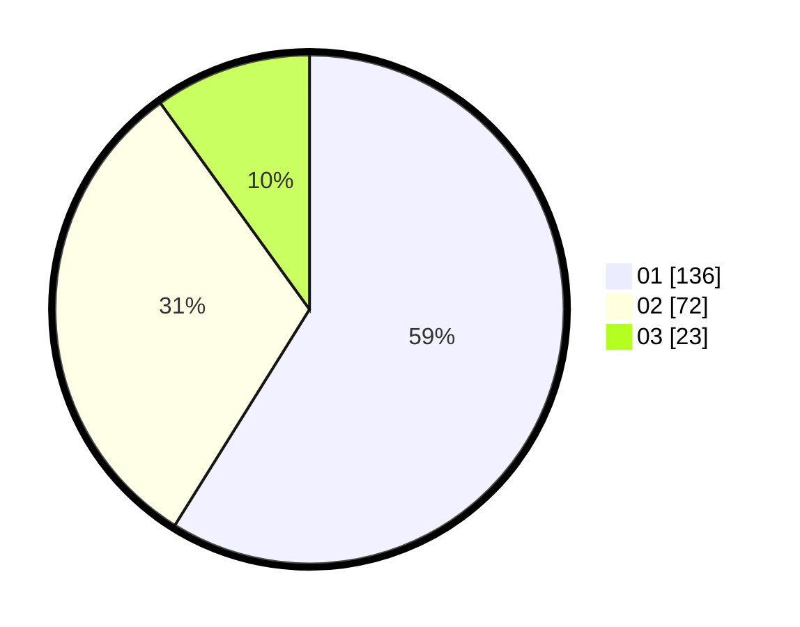

# Hasil

Hasil perolehan suara paslon dapat dilihat pada file paslon-01.txt, paslon-02.txt, dan paslon-03.txt.

Jika tidak ada, artinya data tersebut belum ada pada SIREKAP.

## Perolehan Suara

 * Paslon 01: **136**.
 * Paslon 02: **72**.
 * Paslon 03: **23**.

## Foto C Plano

https://sirekap-obj-formc.kpu.go.id/57e2/pemilu/ppwp/31/73/05/10/01/3173051001171-20240214-221410--678b008f-cf9e-4be7-a8fb-188fcfda53d7.jpg

https://sirekap-obj-formc.kpu.go.id/57e2/pemilu/ppwp/31/73/05/10/01/3173051001171-20240214-221534--67dedaf2-b4e6-4f0f-9446-c79761eeb5ac.jpg

https://sirekap-obj-formc.kpu.go.id/57e2/pemilu/ppwp/31/73/05/10/01/3173051001171-20240214-221733--6c396c09-aafe-4f49-8d88-63ced23cac3e.jpg
