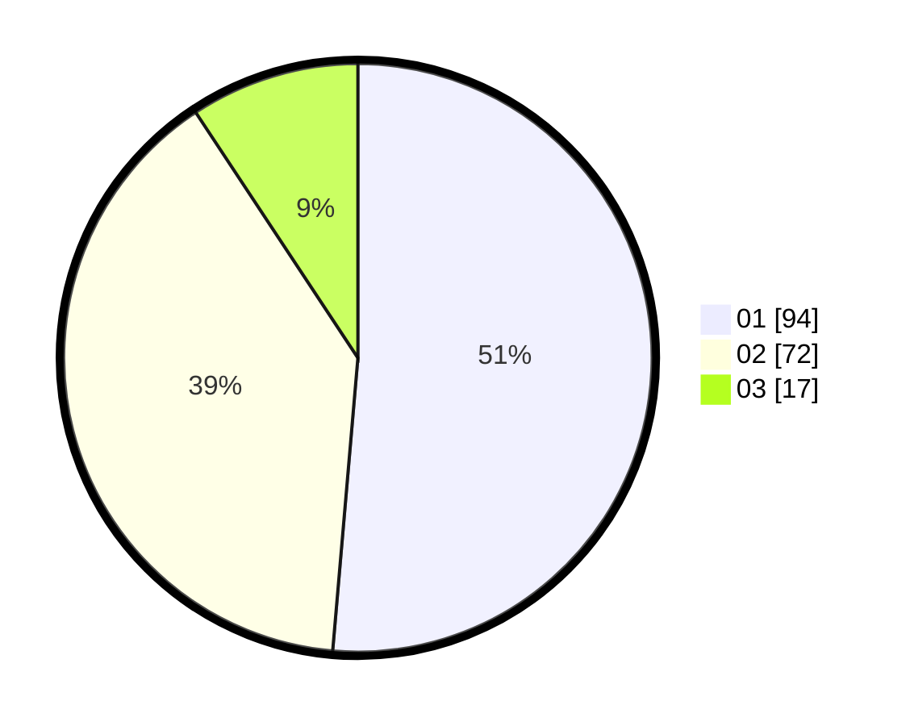

# Hasil

Hasil perolehan suara paslon dapat dilihat pada file paslon-01.txt, paslon-02.txt, dan paslon-03.txt.

Jika tidak ada, artinya data tersebut belum ada pada SIREKAP.

## Perolehan Suara

 * Paslon 01: **94**.
 * Paslon 02: **72**.
 * Paslon 03: **17**.

## Foto C Plano

https://sirekap-obj-formc.kpu.go.id/dcf3/pemilu/ppwp/31/73/05/10/01/3173051001173-20240214-225652--01ef9353-74b4-49b7-9cae-b0759ddb86bf.jpg

https://sirekap-obj-formc.kpu.go.id/dcf3/pemilu/ppwp/31/73/05/10/01/3173051001173-20240214-225815--cad15e42-505a-4a3c-aa39-f57c45362f70.jpg

https://sirekap-obj-formc.kpu.go.id/dcf3/pemilu/ppwp/31/73/05/10/01/3173051001173-20240214-225941--1bb5ba84-22bc-40e6-a20b-cdcfc729489e.jpg
