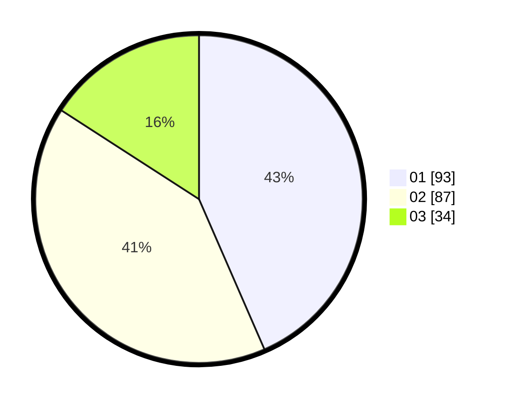

# Hasil

Hasil perolehan suara paslon dapat dilihat pada file paslon-01.txt, paslon-02.txt, dan paslon-03.txt.

Jika tidak ada, artinya data tersebut belum ada pada SIREKAP.

## Perolehan Suara

 * Paslon 01: **93**.
 * Paslon 02: **87**.
 * Paslon 03: **34**.

## Foto C Plano

https://sirekap-obj-formc.kpu.go.id/c421/pemilu/ppwp/31/73/05/10/01/3173051001174-20240214-155909--2d380ff5-fa73-4dbb-9765-14ca5363b939.jpg

https://sirekap-obj-formc.kpu.go.id/c421/pemilu/ppwp/31/73/05/10/01/3173051001174-20240214-160121--77cb96c0-836d-4a14-b998-cad486410617.jpg

https://sirekap-obj-formc.kpu.go.id/c421/pemilu/ppwp/31/73/05/10/01/3173051001174-20240214-160117--be4dfc9e-7533-49cc-8ac6-a208a25724e0.jpg

## DATA PEMILIH TETAP

Jumlah pemilih dalam DPT: **265**.
 * L: **134**.
 * P: **131**.

## DATA PENGGUNA HAK PILIH

Jumlah pengguna hak pilih dalam DPT: **210**.
 * L: **102**.
 * P: **108**.

Jumlah pengguna hak pilih dalam DPTb: **6**.
 * L: **4**.
 * P: **2**.

Jumlah pengguna hak pilih dalam DPK: **1**.
 * L: **1**.
 * P: **0**.

Jumlah pengguna hak pilih: **217**.
 * L: **107**.
 * P: **110**.

## JUMLAH SUARA SAH DAN TIDAK SAH

JUMLAH SELURUH SUARA SAH: **214**.

JUMLAH SUARA TIDAK SAH: **3**.

JUMLAH SELURUH SUARA SAH DAN SUARA TIDAK SAH: **217**.
