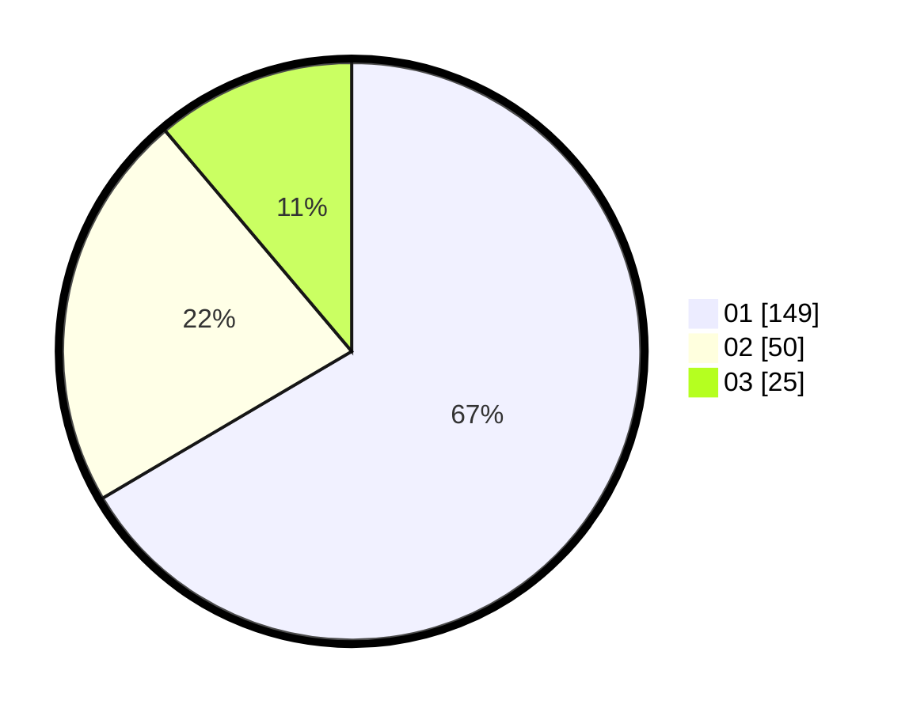

# Hasil

Hasil perolehan suara paslon dapat dilihat pada file paslon-01.txt, paslon-02.txt, dan paslon-03.txt.

Jika tidak ada, artinya data tersebut belum ada pada SIREKAP.

## Perolehan Suara

 * Paslon 01: **149**.
 * Paslon 02: **50**.
 * Paslon 03: **25**.

## Foto C Plano

https://sirekap-obj-formc.kpu.go.id/717f/pemilu/ppwp/31/73/05/10/01/3173051001181-20240214-225200--064f36a8-23a2-4a80-85fd-c67ff0b8cbd1.jpg

https://sirekap-obj-formc.kpu.go.id/717f/pemilu/ppwp/31/73/05/10/01/3173051001181-20240214-225241--bd409009-d093-4d2d-859f-6219436b6340.jpg

https://sirekap-obj-formc.kpu.go.id/717f/pemilu/ppwp/31/73/05/10/01/3173051001181-20240214-225352--c9249765-4693-4921-a322-c58b69a869dc.jpg
