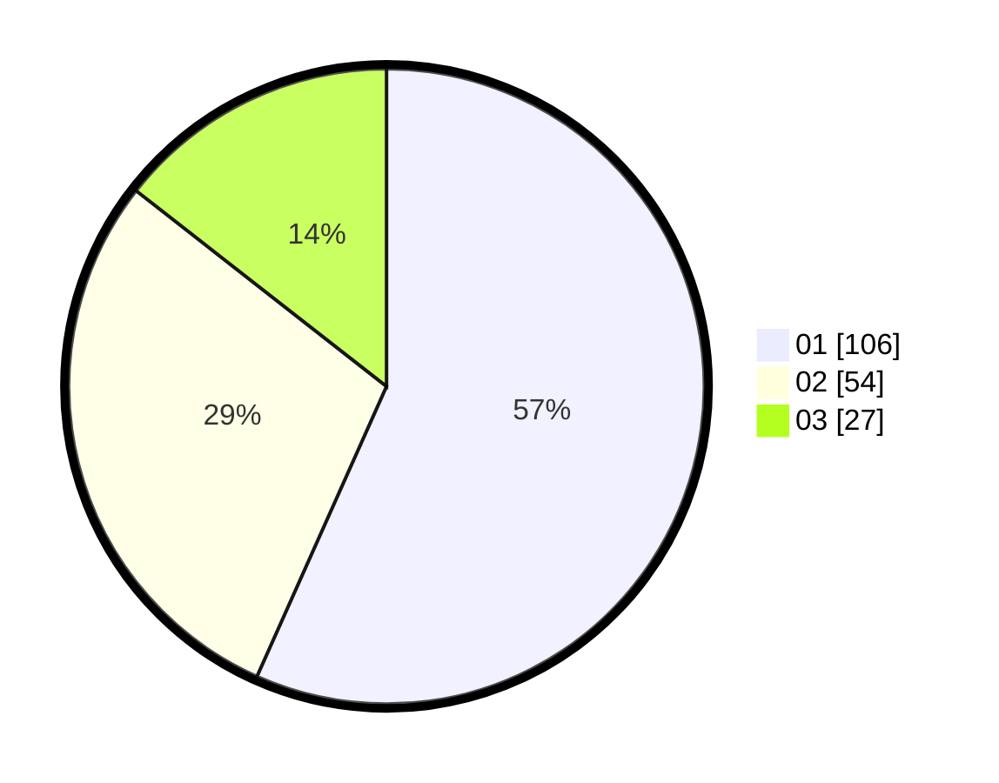

# Hasil

Hasil perolehan suara paslon dapat dilihat pada file paslon-01.txt, paslon-02.txt, dan paslon-03.txt.

Jika tidak ada, artinya data tersebut belum ada pada SIREKAP.

## Perolehan Suara

 * Paslon 01: **106**.
 * Paslon 02: **54**.
 * Paslon 03: **27**.

## Foto C Plano

https://sirekap-obj-formc.kpu.go.id/dc64/pemilu/ppwp/31/73/05/10/01/3173051001185-20240216-021459--d2e1b41c-197f-4199-ada9-b1ea6b4f8e67.jpg

https://sirekap-obj-formc.kpu.go.id/dc64/pemilu/ppwp/31/73/05/10/01/3173051001185-20240216-021510--53fd4487-ac1b-40fa-8891-892ce423cbf2.jpg

https://sirekap-obj-formc.kpu.go.id/dc64/pemilu/ppwp/31/73/05/10/01/3173051001185-20240216-021506--1c8c72d6-e1b2-43bd-801d-95ddf198f34c.jpg

## DATA PEMILIH TETAP

Jumlah pemilih dalam DPT: **238**.
 * L: **110**.
 * P: **128**.

## DATA PENGGUNA HAK PILIH

Jumlah pengguna hak pilih dalam DPT: **185**.
 * L: **83**.
 * P: **102**.

Jumlah pengguna hak pilih dalam DPTb: **2**.
 * L: **1**.
 * P: **1**.

Jumlah pengguna hak pilih dalam DPK: **0**.
 * L: **0**.
 * P: **0**.

Jumlah pengguna hak pilih: **187**.
 * L: **84**.
 * P: **103**.

## JUMLAH SUARA SAH DAN TIDAK SAH

JUMLAH SELURUH SUARA SAH: **187**.

JUMLAH SUARA TIDAK SAH: **0**.

JUMLAH SELURUH SUARA SAH DAN SUARA TIDAK SAH: **187**.
