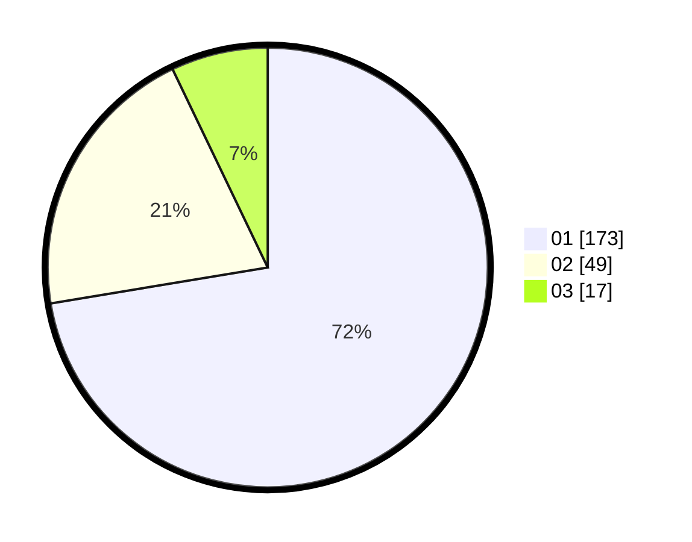

# Hasil

Hasil perolehan suara paslon dapat dilihat pada file paslon-01.txt, paslon-02.txt, dan paslon-03.txt.

Jika tidak ada, artinya data tersebut belum ada pada SIREKAP.

## Perolehan Suara

 * Paslon 01: **173**.
 * Paslon 02: **49**.
 * Paslon 03: **17**.

## Foto C Plano

https://sirekap-obj-formc.kpu.go.id/efcb/pemilu/ppwp/31/73/05/10/01/3173051001186-20240214-215930--9e2f0da5-91c8-4ee8-97af-69d60ebf080c.jpg

https://sirekap-obj-formc.kpu.go.id/efcb/pemilu/ppwp/31/73/05/10/01/3173051001186-20240214-220243--5dcbdf06-59be-4e92-bec1-6ebd4af66c07.jpg

https://sirekap-obj-formc.kpu.go.id/efcb/pemilu/ppwp/31/73/05/10/01/3173051001186-20240214-220428--a1e1cdb6-2581-402c-9e00-cfaa4436d663.jpg
