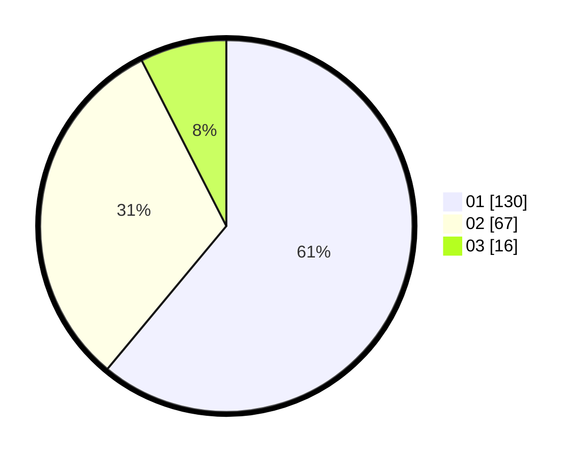

# Hasil

Hasil perolehan suara paslon dapat dilihat pada file paslon-01.txt, paslon-02.txt, dan paslon-03.txt.

Jika tidak ada, artinya data tersebut belum ada pada SIREKAP.

## Perolehan Suara

 * Paslon 01: **130**.
 * Paslon 02: **67**.
 * Paslon 03: **16**.

## Foto C Plano

https://sirekap-obj-formc.kpu.go.id/ee98/pemilu/ppwp/31/73/05/10/02/3173051002002-20240216-195036--747c7263-7a1a-4fe2-9cc7-0315f100f527.jpg

https://sirekap-obj-formc.kpu.go.id/ee98/pemilu/ppwp/31/73/05/10/02/3173051002002-20240216-195037--6bcd639f-1f52-439d-817a-e8b94327d1de.jpg

https://sirekap-obj-formc.kpu.go.id/ee98/pemilu/ppwp/31/73/05/10/02/3173051002002-20240216-195036--ba0ac988-5374-4081-bf0e-65e320d334ef.jpg

## DATA PEMILIH TETAP

Jumlah pemilih dalam DPT: **279**.
 * L: **136**.
 * P: **143**.

## DATA PENGGUNA HAK PILIH

Jumlah pengguna hak pilih dalam DPT: **209**.
 * L: **93**.
 * P: **115**.

Jumlah pengguna hak pilih dalam DPTb: **3**.
 * L: **1**.
 * P: **2**.

Jumlah pengguna hak pilih dalam DPK: **3**.
 * L: **1**.
 * P: **2**.

Jumlah pengguna hak pilih: **214**.
 * L: **95**.
 * P: **119**.

## JUMLAH SUARA SAH DAN TIDAK SAH

JUMLAH SELURUH SUARA SAH: **213**.

JUMLAH SUARA TIDAK SAH: **1**.

JUMLAH SELURUH SUARA SAH DAN SUARA TIDAK SAH: **214**.
