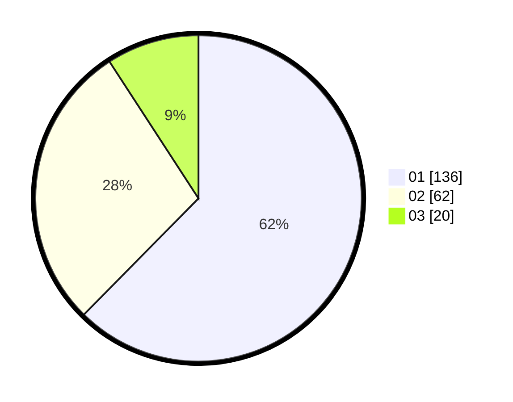

# Hasil

Hasil perolehan suara paslon dapat dilihat pada file paslon-01.txt, paslon-02.txt, dan paslon-03.txt.

Jika tidak ada, artinya data tersebut belum ada pada SIREKAP.

## Perolehan Suara

 * Paslon 01: **136**.
 * Paslon 02: **62**.
 * Paslon 03: **20**.

## Foto C Plano

https://sirekap-obj-formc.kpu.go.id/89d4/pemilu/ppwp/31/73/05/10/02/3173051002015-20240214-184536--0b0b82d9-2b01-4b53-a346-d386ef85829a.jpg

https://sirekap-obj-formc.kpu.go.id/89d4/pemilu/ppwp/31/73/05/10/02/3173051002015-20240214-185330--7141c521-361d-44d4-afd5-8089cff8f9a8.jpg

https://sirekap-obj-formc.kpu.go.id/89d4/pemilu/ppwp/31/73/05/10/02/3173051002015-20240214-185559--debd28bc-4abc-49d6-ac75-2f2c7d409878.jpg
