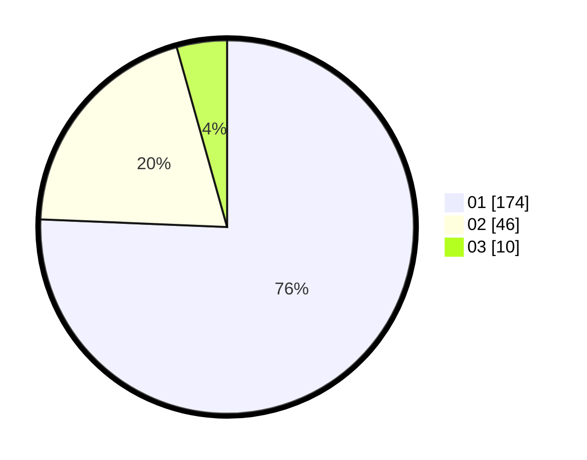

# Hasil

Hasil perolehan suara paslon dapat dilihat pada file paslon-01.txt, paslon-02.txt, dan paslon-03.txt.

Jika tidak ada, artinya data tersebut belum ada pada SIREKAP.

## Perolehan Suara

 * Paslon 01: **174**.
 * Paslon 02: **46**.
 * Paslon 03: **10**.

## Foto C Plano

https://sirekap-obj-formc.kpu.go.id/eb1c/pemilu/ppwp/31/73/05/10/02/3173051002019-20240216-142555--dd8d0250-7e73-417f-bb80-59b33e6333c8.jpg

https://sirekap-obj-formc.kpu.go.id/eb1c/pemilu/ppwp/31/73/05/10/02/3173051002019-20240214-193200--2da959c9-d4fb-4d5a-b304-4ec37e8fde63.jpg

https://sirekap-obj-formc.kpu.go.id/eb1c/pemilu/ppwp/31/73/05/10/02/3173051002019-20240216-142555--79f34368-cb6d-40d7-9af0-4188a2f93ce0.jpg

## DATA PEMILIH TETAP

Jumlah pemilih dalam DPT: **279**.
 * L: **137**.
 * P: **142**.

## DATA PENGGUNA HAK PILIH

Jumlah pengguna hak pilih dalam DPT: **226**.
 * L: **110**.
 * P: **116**.

Jumlah pengguna hak pilih dalam DPTb: **5**.
 * L: **1**.
 * P: **4**.

Jumlah pengguna hak pilih dalam DPK: **0**.
 * L: **0**.
 * P: **0**.

Jumlah pengguna hak pilih: **231**.
 * L: **111**.
 * P: **120**.

## JUMLAH SUARA SAH DAN TIDAK SAH

JUMLAH SELURUH SUARA SAH: **230**.

JUMLAH SUARA TIDAK SAH: **1**.

JUMLAH SELURUH SUARA SAH DAN SUARA TIDAK SAH: **231**.
