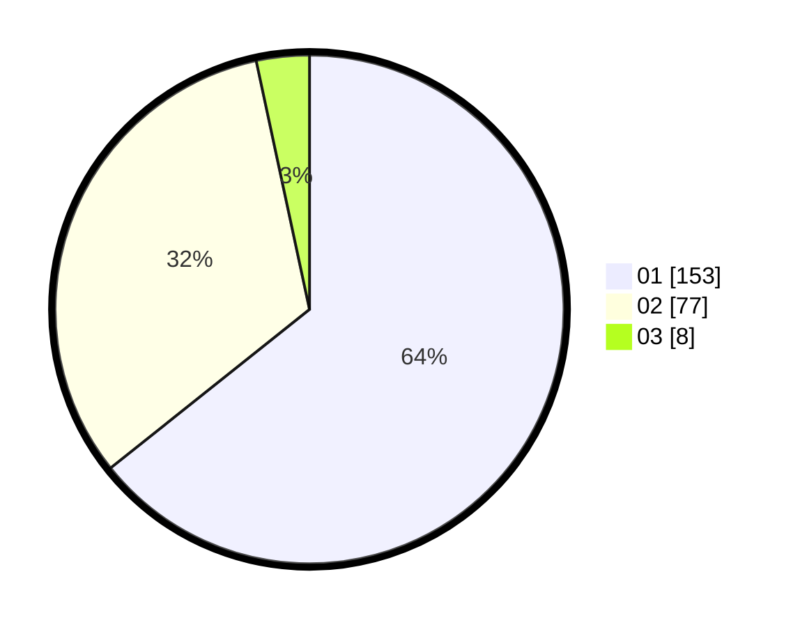

# Hasil

Hasil perolehan suara paslon dapat dilihat pada file paslon-01.txt, paslon-02.txt, dan paslon-03.txt.

Jika tidak ada, artinya data tersebut belum ada pada SIREKAP.

## Perolehan Suara

 * Paslon 01: **153**.
 * Paslon 02: **77**.
 * Paslon 03: **8**.

## Foto C Plano

https://sirekap-obj-formc.kpu.go.id/0fb2/pemilu/ppwp/31/73/05/10/02/3173051002028-20240217-180418--2035fd7d-ae6d-417e-8a83-ae32a5b740ff.jpg

https://sirekap-obj-formc.kpu.go.id/0fb2/pemilu/ppwp/31/73/05/10/02/3173051002028-20240217-180155--2b3ba4e3-0e93-44c8-aa1c-219caf0dce02.jpg

https://sirekap-obj-formc.kpu.go.id/0fb2/pemilu/ppwp/31/73/05/10/02/3173051002028-20240217-180255--b4d7fb68-36b1-4b0e-8e1b-542b360088b6.jpg
