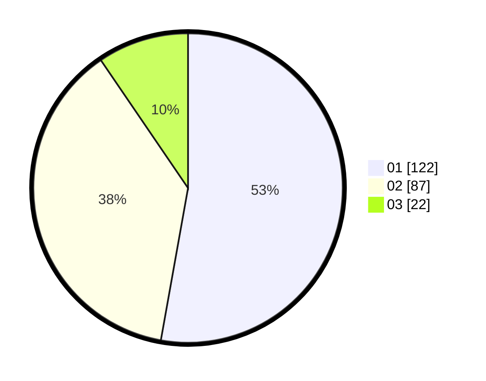

# Hasil

Hasil perolehan suara paslon dapat dilihat pada file paslon-01.txt, paslon-02.txt, dan paslon-03.txt.

Jika tidak ada, artinya data tersebut belum ada pada SIREKAP.

## Perolehan Suara

 * Paslon 01: **122**.
 * Paslon 02: **87**.
 * Paslon 03: **22**.

## Foto C Plano

https://sirekap-obj-formc.kpu.go.id/3407/pemilu/ppwp/31/73/05/10/02/3173051002033-20240216-064149--9d9f51f5-73e5-4b56-b4a7-7ff9340c4682.jpg

https://sirekap-obj-formc.kpu.go.id/3407/pemilu/ppwp/31/73/05/10/02/3173051002033-20240216-064151--e9e4f479-01b8-438e-b7b3-30bce926fe1b.jpg

https://sirekap-obj-formc.kpu.go.id/3407/pemilu/ppwp/31/73/05/10/02/3173051002033-20240216-064150--0de38852-0072-4e0b-91dc-07ba048ff19a.jpg

## DATA PEMILIH TETAP

Jumlah pemilih dalam DPT: **276**.
 * L: **131**.
 * P: **145**.

## DATA PENGGUNA HAK PILIH

Jumlah pengguna hak pilih dalam DPT: **231**.
 * L: **105**.
 * P: **126**.

Jumlah pengguna hak pilih dalam DPTb: **0**.
 * L: **0**.
 * P: **0**.

Jumlah pengguna hak pilih dalam DPK: **4**.
 * L: **2**.
 * P: **2**.

Jumlah pengguna hak pilih: **235**.
 * L: **107**.
 * P: **128**.

## JUMLAH SUARA SAH DAN TIDAK SAH

JUMLAH SELURUH SUARA SAH: **231**.

JUMLAH SUARA TIDAK SAH: **4**.

JUMLAH SELURUH SUARA SAH DAN SUARA TIDAK SAH: **235**.
