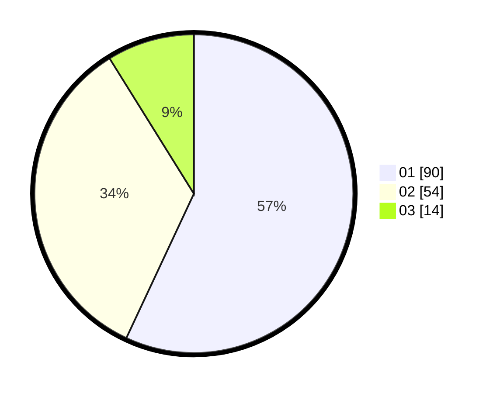

# Hasil

Hasil perolehan suara paslon dapat dilihat pada file paslon-01.txt, paslon-02.txt, dan paslon-03.txt.

Jika tidak ada, artinya data tersebut belum ada pada SIREKAP.

## Perolehan Suara

 * Paslon 01: **90**.
 * Paslon 02: **54**.
 * Paslon 03: **14**.

## Foto C Plano

https://sirekap-obj-formc.kpu.go.id/87be/pemilu/ppwp/31/73/05/10/02/3173051002034-20240214-194057--d81537c9-24b2-49db-9245-2be0931efb2f.jpg

https://sirekap-obj-formc.kpu.go.id/87be/pemilu/ppwp/31/73/05/10/02/3173051002034-20240216-004833--d9559b6a-414c-4ffa-8bda-cf42c992bcf0.jpg

https://sirekap-obj-formc.kpu.go.id/87be/pemilu/ppwp/31/73/05/10/02/3173051002034-20240216-004831--b768c3fc-6d3c-4252-ada9-06d2c49c81ae.jpg

## DATA PEMILIH TETAP

Jumlah pemilih dalam DPT: **202**.
 * L: **97**.
 * P: **105**.

## DATA PENGGUNA HAK PILIH

Jumlah pengguna hak pilih dalam DPT: **158**.
 * L: **75**.
 * P: **83**.

Jumlah pengguna hak pilih dalam DPTb: **0**.
 * L: **0**.
 * P: **0**.

Jumlah pengguna hak pilih dalam DPK: **3**.
 * L: **2**.
 * P: **1**.

Jumlah pengguna hak pilih: **161**.
 * L: **77**.
 * P: **84**.

## JUMLAH SUARA SAH DAN TIDAK SAH

JUMLAH SELURUH SUARA SAH: **158**.

JUMLAH SUARA TIDAK SAH: **3**.

JUMLAH SELURUH SUARA SAH DAN SUARA TIDAK SAH: **161**.
