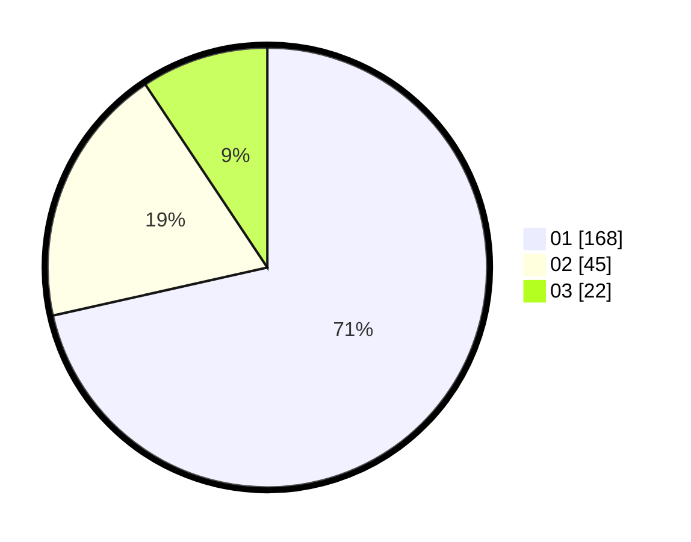

# Hasil

Hasil perolehan suara paslon dapat dilihat pada file paslon-01.txt, paslon-02.txt, dan paslon-03.txt.

Jika tidak ada, artinya data tersebut belum ada pada SIREKAP.

## Perolehan Suara

 * Paslon 01: **168**.
 * Paslon 02: **45**.
 * Paslon 03: **22**.

## Foto C Plano

https://sirekap-obj-formc.kpu.go.id/1b30/pemilu/ppwp/31/73/05/10/02/3173051002045-20240214-211541--e2669343-f4f0-44d3-9489-99d722edbd2f.jpg

https://sirekap-obj-formc.kpu.go.id/1b30/pemilu/ppwp/31/73/05/10/02/3173051002045-20240214-212039--a5c3cf36-923b-4581-b407-1c0f1e71d1af.jpg

https://sirekap-obj-formc.kpu.go.id/1b30/pemilu/ppwp/31/73/05/10/02/3173051002045-20240214-203421--00ee597f-92fd-485a-9a40-99c5cd556655.jpg
