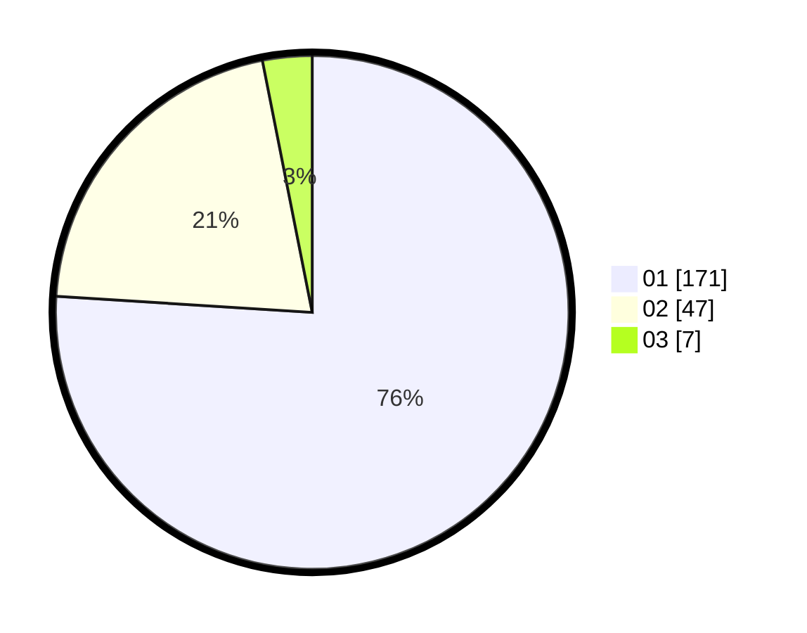

# Hasil

Hasil perolehan suara paslon dapat dilihat pada file paslon-01.txt, paslon-02.txt, dan paslon-03.txt.

Jika tidak ada, artinya data tersebut belum ada pada SIREKAP.

## Perolehan Suara

 * Paslon 01: **171**.
 * Paslon 02: **47**.
 * Paslon 03: **7**.

## Foto C Plano

https://sirekap-obj-formc.kpu.go.id/7d63/pemilu/ppwp/31/73/05/10/02/3173051002046-20240215-002636--ec332cdf-7977-4bdf-80ec-7fa6f11db2f3.jpg

https://sirekap-obj-formc.kpu.go.id/7d63/pemilu/ppwp/31/73/05/10/02/3173051002046-20240215-002043--00499742-8d28-4c69-afa5-6af58b0dadfc.jpg

https://sirekap-obj-formc.kpu.go.id/7d63/pemilu/ppwp/31/73/05/10/02/3173051002046-20240215-000050--a24d0597-bc61-4a8f-b533-eb21fa71fc1a.jpg
