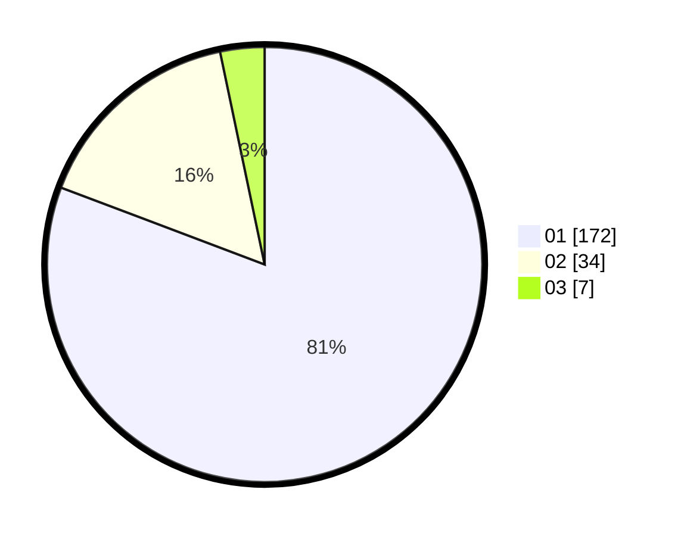

# Hasil

Hasil perolehan suara paslon dapat dilihat pada file paslon-01.txt, paslon-02.txt, dan paslon-03.txt.

Jika tidak ada, artinya data tersebut belum ada pada SIREKAP.

## Perolehan Suara

 * Paslon 01: **172**.
 * Paslon 02: **34**.
 * Paslon 03: **7**.

## Foto C Plano

https://sirekap-obj-formc.kpu.go.id/4d75/pemilu/ppwp/31/73/05/10/02/3173051002047-20240214-220239--4885e209-c06f-4931-8f47-49d401c979e7.jpg

https://sirekap-obj-formc.kpu.go.id/4d75/pemilu/ppwp/31/73/05/10/02/3173051002047-20240214-220546--a1ba0f61-33d9-470d-882f-2c4270a23d6a.jpg
