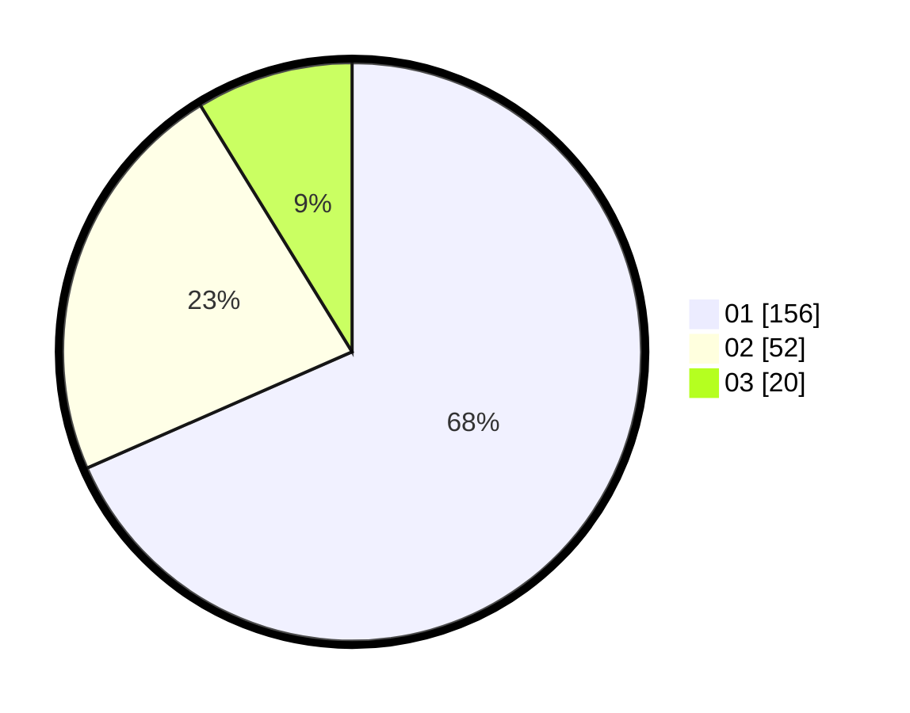

# Hasil

Hasil perolehan suara paslon dapat dilihat pada file paslon-01.txt, paslon-02.txt, dan paslon-03.txt.

Jika tidak ada, artinya data tersebut belum ada pada SIREKAP.

## Perolehan Suara

 * Paslon 01: **156**.
 * Paslon 02: **52**.
 * Paslon 03: **20**.

## Foto C Plano

https://sirekap-obj-formc.kpu.go.id/1cac/pemilu/ppwp/31/73/05/10/02/3173051002048-20240214-211028--52c527d6-3bb0-422f-b76e-46b97ac0d5f1.jpg

https://sirekap-obj-formc.kpu.go.id/1cac/pemilu/ppwp/31/73/05/10/02/3173051002048-20240214-211146--9edb6d59-7db5-4ffe-8b1a-f9f3f5813630.jpg

https://sirekap-obj-formc.kpu.go.id/1cac/pemilu/ppwp/31/73/05/10/02/3173051002048-20240214-211323--b46ba04c-1637-4877-ba9b-0f738aea87a2.jpg
