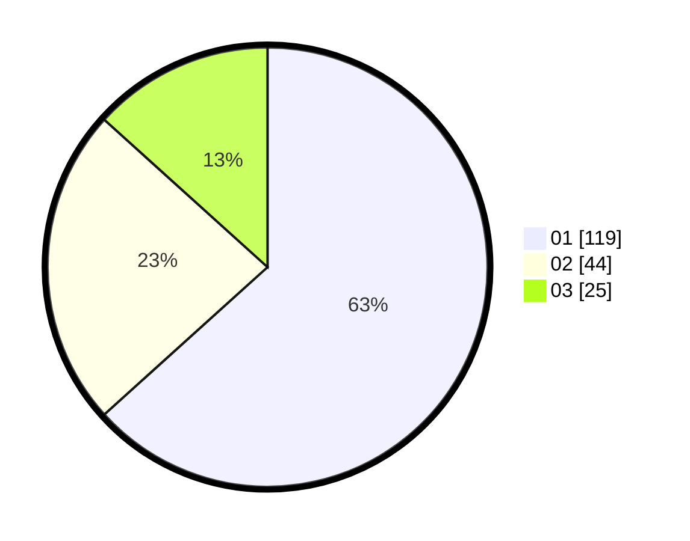

# Hasil

Hasil perolehan suara paslon dapat dilihat pada file paslon-01.txt, paslon-02.txt, dan paslon-03.txt.

Jika tidak ada, artinya data tersebut belum ada pada SIREKAP.

## Perolehan Suara

 * Paslon 01: **119**.
 * Paslon 02: **44**.
 * Paslon 03: **25**.

## Foto C Plano

https://sirekap-obj-formc.kpu.go.id/e94c/pemilu/ppwp/31/73/05/10/02/3173051002049-20240214-192511--24b5d40f-097d-4309-b517-82620a004723.jpg

https://sirekap-obj-formc.kpu.go.id/e94c/pemilu/ppwp/31/73/05/10/02/3173051002049-20240214-192629--a58edc82-9666-4cce-811b-9d64cf45bac0.jpg
