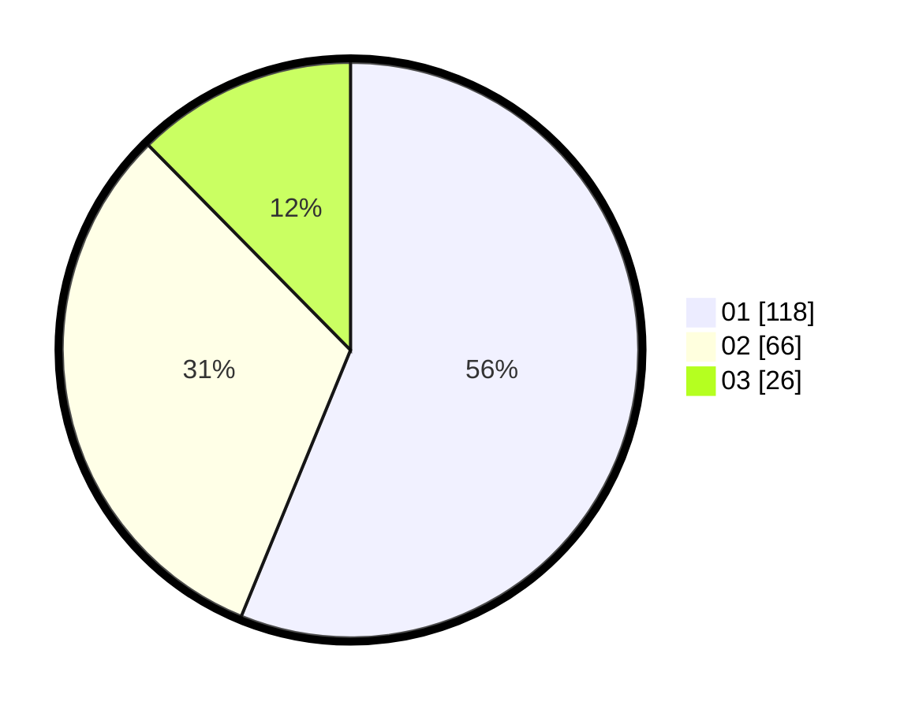

# Hasil

Hasil perolehan suara paslon dapat dilihat pada file paslon-01.txt, paslon-02.txt, dan paslon-03.txt.

Jika tidak ada, artinya data tersebut belum ada pada SIREKAP.

## Perolehan Suara

 * Paslon 01: **118**.
 * Paslon 02: **66**.
 * Paslon 03: **26**.

## Foto C Plano

https://sirekap-obj-formc.kpu.go.id/e62a/pemilu/ppwp/31/73/05/10/02/3173051002050-20240214-234222--f141e414-9550-4381-b276-683fa73668fb.jpg

https://sirekap-obj-formc.kpu.go.id/e62a/pemilu/ppwp/31/73/05/10/02/3173051002050-20240214-234345--eaca195e-ef25-4951-93ce-bb92260267fc.jpg

https://sirekap-obj-formc.kpu.go.id/e62a/pemilu/ppwp/31/73/05/10/02/3173051002050-20240214-234420--ca31fa65-1eb4-4a0b-9051-7585c51a1f78.jpg
