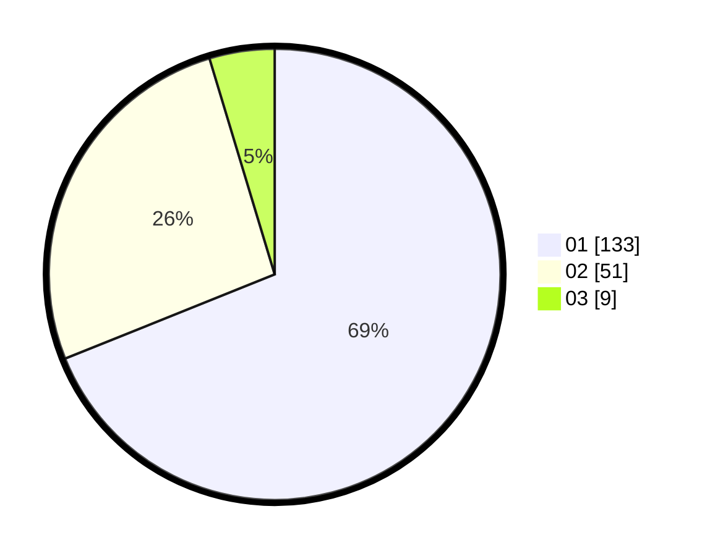

# Hasil

Hasil perolehan suara paslon dapat dilihat pada file paslon-01.txt, paslon-02.txt, dan paslon-03.txt.

Jika tidak ada, artinya data tersebut belum ada pada SIREKAP.

## Perolehan Suara

 * Paslon 01: **133**.
 * Paslon 02: **51**.
 * Paslon 03: **9**.

## Foto C Plano

https://sirekap-obj-formc.kpu.go.id/1d6e/pemilu/ppwp/31/73/05/10/02/3173051002055-20240215-003932--c3471377-ca69-4488-a341-e8ddb3e8674f.jpg

https://sirekap-obj-formc.kpu.go.id/1d6e/pemilu/ppwp/31/73/05/10/02/3173051002055-20240215-004320--15c92d18-ab29-4e20-b4b1-702ee4cb9f8e.jpg

https://sirekap-obj-formc.kpu.go.id/1d6e/pemilu/ppwp/31/73/05/10/02/3173051002055-20240215-004821--e34ef2ca-f63b-425f-9140-8081fbf57bcc.jpg
